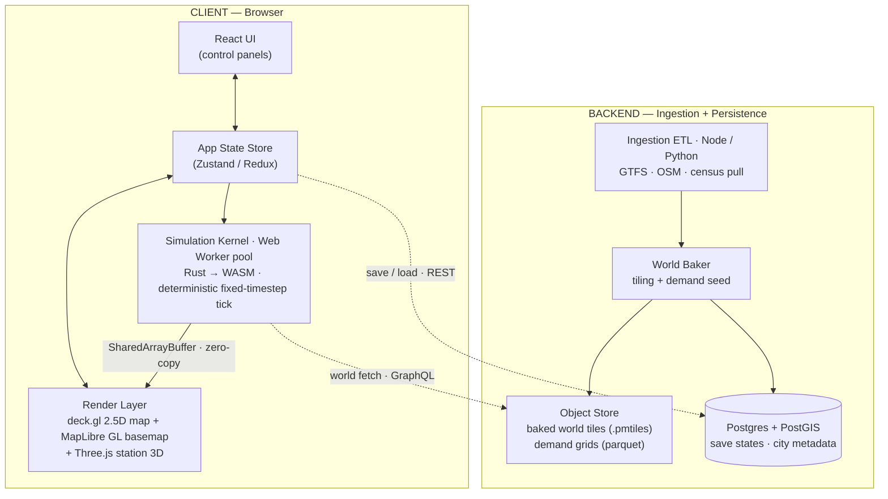
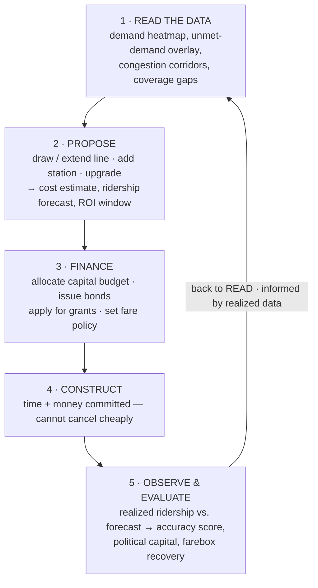
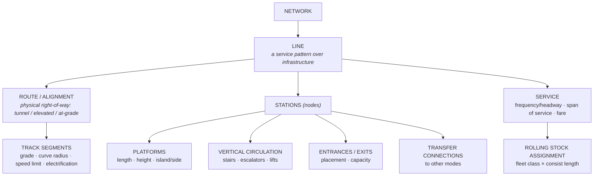
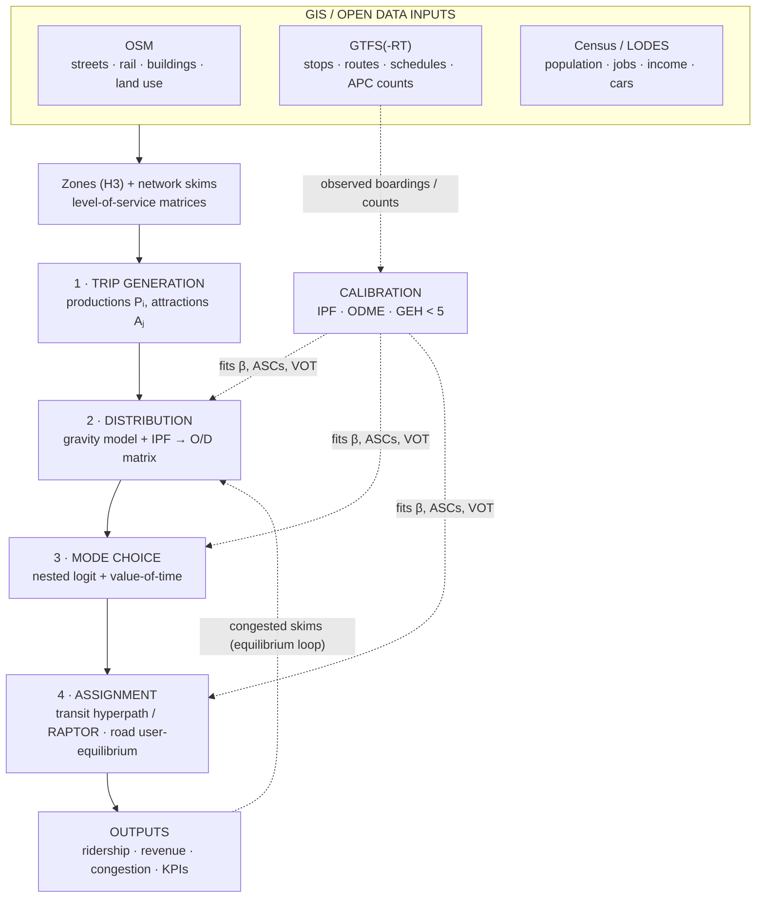
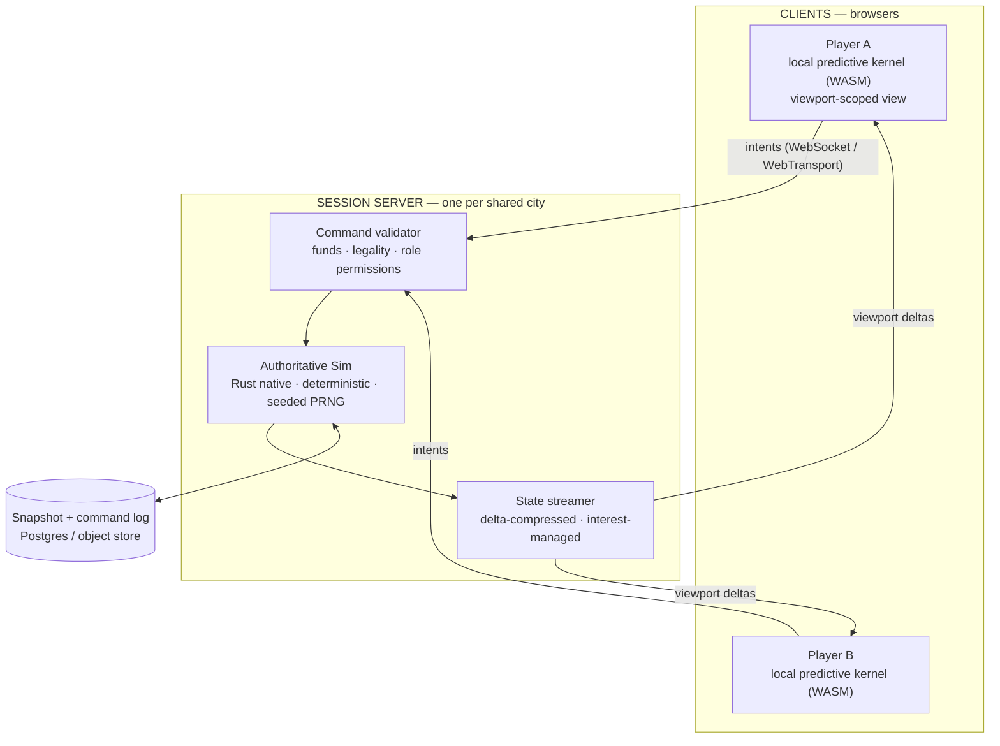

# Game Design Document — *Metro*

**A browser-based, data-driven public transit simulation**

| | |
|---|---|
| **Document type** | Game Design Document (GDD) — Master |
| **Version** | 0.9 (Draft) |
| **Owner** | Lead Systems Designer / Full-Stack Architect |
| **Status** | For technical review |
| **Genre** | Serious simulation / management |
| **Platform** | Web (evergreen desktop browsers; tablet as secondary) |
| **Design pillars** | Data fidelity · Consequential planning · Legible complexity |

---

## 0. Design Philosophy & Pillars

This project is a **serious simulation**, not an arcade tycoon game. The distinction is enforced through three non-negotiable design pillars that every mechanic must serve:

1. **Data Fidelity.** The game world is *derived*, not authored. Streets, population, employment, and baseline service come from open datasets (OSM, GTFS, census). The player operates on a real city, and the simulation's plausibility is its core value proposition.
2. **Consequential Planning.** Decisions are slow, expensive, and interdependent. There is no "undo" on a tunnel bore. The player is rewarded for foresight, sensitivity analysis, and reading the data — not reflexes or click-throughput.
3. **Legible Complexity.** The simulation is deep, but never opaque. Every number the player sees must be traceable to its inputs. The UI's primary job is to make a high-dimensional system *inspectable* without overwhelming the operator.

**Anti-goals:** cartoon physics, "pop-up disaster" events for their own sake, infinite money glitches, twitch micro-management, and any mechanic whose outcome cannot be explained by the model.

---

## 1. Technical Stack & Data Architecture

### 1.1 High-Level Architecture

The application is a **client-heavy single-page application** backed by a thin ingestion/persistence service. Heavy simulation runs in the browser (Web Workers + WASM) to keep interaction latency low and server costs bounded; the backend is responsible for data ingestion, world "baking," and save-state persistence.



### 1.2 Client Tech Stack

| Layer | Choice | Rationale |
|---|---|---|
| **UI framework** | **React 18** + TypeScript | Component model fits panelized control surfaces; concurrent rendering keeps the UI responsive while the sim ticks. |
| **State** | **Zustand** (transient/UI) + immutable sim snapshots | Avoids Redux boilerplate; sim state is owned by the worker, UI subscribes to read-only snapshots. |
| **Geospatial render** | **deck.gl** over a **MapLibre GL** basemap | deck.gl's layered GPU rendering (`ScatterplotLayer`, `PathLayer`, `TripsLayer`, `HeatmapLayer`, `PolygonLayer`) is purpose-built for large moving datasets — thousands of vehicles and demand cells at 60 fps. |
| **Close-up 3D** | **Three.js** (via `react-three-fiber`), embedded as a deck.gl custom layer | Station-level "build mode" needs true 3D (platforms, mezzanines, rolling stock). deck.gl handles the city; Three.js handles the building interior/close inspection. |
| **Basemap tiles** | Self-hosted **PMTiles** (vector) generated from OSM | No per-tile API cost; ships in the baked world bundle; fully offline-capable. |
| **Simulation kernel** | **Rust compiled to WASM**, run in a **Web Worker** pool | Deterministic, fast, memory-controlled. Rust's lack of GC pauses matters for a fixed-timestep simulation. |
| **Sim ↔ render transport** | **SharedArrayBuffer** + `Atomics` | Vehicle position/state buffers are written by the worker and read by deck.gl with zero serialization. |
| **Charts / telemetry** | **Recharts / VisX** for panels; deck.gl for spatial | Standard 2D analytics vs. spatial analytics split cleanly. |
| **Build** | Vite + wasm-pack | Fast HMR; WASM as a first-class module. |

**Why WASM for the kernel and not TypeScript?** The core loop is an agent/flow simulation over tens of thousands of demand cells and vehicles at a fixed 4 Hz sim tick (interpolated to 60 Hz for rendering). JS GC pauses produce non-determinism and frame hitching. A Rust kernel gives us (a) determinism for reproducible outcomes and replay, (b) bounded memory, and (c) 5–20× throughput headroom.

### 1.3 Backend Tech Stack

| Concern | Choice | Rationale |
|---|---|---|
| **Ingestion ETL** | Python (pandas + `partridge` for GTFS, `osmium`/`pyrosm` for OSM) | Richest ecosystem for GTFS/OSM parsing. |
| **API** | Node (Fastify) or Python (FastAPI) — GraphQL for world queries, REST for saves | GraphQL lets the client request only the map bbox + layers it needs. |
| **Spatial DB** | **PostgreSQL + PostGIS** | Authoritative store for city metadata, routing graphs, and save states; spatial indexing for tile queries. |
| **Baked artifacts** | Object storage (S3-compatible) — **PMTiles** for geometry, **Parquet** for demand grids | Static, cacheable, CDN-friendly. The "world" is a bundle, not a live query. |
| **Auth/Saves** | JWT + row-level save ownership | Saves are large binary blobs (sim snapshots) keyed to user + city. |

### 1.4 Data Ingestion Pipeline — From Open Data to Playable World

The pipeline transforms three open-data sources into a single **Baked World Bundle**. This is a batch, offline process ("world baking"), run per-city, not at runtime.

**Inputs**

| Source | Format | What we extract |
|---|---|---|
| **OpenStreetMap** | `.osm.pbf` | Street network (with road class, lanes, one-way, speed), rail geometry, land-use polygons, building footprints (with `building:levels` for volume). |
| **GTFS / GTFS-RT** | Zipped CSV feeds | `stops`, `routes`, `trips`, `stop_times`, `shapes`, `frequencies`, `calendar`. This yields the **baseline** network the player inherits and the **service pattern** used to calibrate demand. |
| **Census / land-use** | Census tracts (e.g., LODES/ACS), or OSM-derived proxy | Residential population, employment by tract, points of interest (schools, hospitals, retail) → the **origin/destination demand seed**. |

**Baking stages**

1. **Conflation.** Snap GTFS stop coordinates onto the OSM rail/road network; resolve rail alignment geometry from `shapes.txt`; build a connected multimodal graph (walk edges + transit edges + road edges).
2. **Demand seeding.** Rasterize the city into a hex grid (H3, resolution ~9, ≈174 m edge). Each cell gets:
   - `pop` (residents), `jobs` (employment), `poi_weight` (attraction mass by category).
   - A **land-use class** (residential / commercial / industrial / mixed / institutional / green).
3. **Baseline O/D matrix generation.** From GTFS service levels + census, derive a synthetic morning-peak origin–destination matrix using a **doubly-constrained gravity model** (see §4.1). This matrix is the *ground truth of latent demand* the player is trying to serve.
4. **Calibration against reality.** Where GTFS-RT or published ridership stats exist, scale the gravity model's friction and attraction coefficients until the *baseline* network's simulated boardings match the *real* network's reported boardings (the **accuracy model**, §2.5). Store the calibrated coefficients in the bundle.
5. **Tiling & export.** Emit PMTiles (geometry), Parquet (demand grid + O/D), and a compact routing graph (CSR adjacency) for the WASM kernel.

**Output: the Baked World Bundle** — a versioned, immutable, CDN-served artifact:

```
world/{city}/{version}/
  ├─ basemap.pmtiles          # streets, land use, water (render)
  ├─ network.graph.bin        # CSR multimodal graph (sim kernel)
  ├─ demand.h3.parquet        # per-cell pop/jobs/poi/landuse
  ├─ od_baseline.parquet      # calibrated O/D matrix
  ├─ gtfs_baseline.json       # inherited routes/stops/service
  └─ calibration.json         # gravity coeffs, accuracy factors
```

> **Design consequence:** because the world is *baked*, the same city version is byte-identical for every player, which makes leaderboards, scenario challenges, and shared saves meaningful. Data refreshes (new GTFS feed) produce a new immutable version rather than mutating live worlds.

---

## 2. Core Gameplay Loops

The game is structured as **three nested loops** operating at different time horizons. This layering is what separates it from click-driven management games: the player spends most of their time in the strategic and tactical loops, and the moment-to-moment loop is largely *observational*.

### 2.1 The Strategic Loop — Capital Planning (horizon: years)

The player acts as the transit authority's planning division.



### 2.2 The Tactical Loop — Service Operations (horizon: weeks)

Given the built network, the player tunes *how it is run*:

- **Frequency & headways** per route, per time-of-day band (AM peak / midday / PM peak / evening / night).
- **Rolling-stock assignment** — which fleet class runs which line; consist length (number of cars).
- **Fare structure** — flat, zonal, or distance-based; transfer policy; concession fares.
- **Crew & depot logistics** — shift rostering, depot capacity, deadheading.

Each tactical decision has an **operating cost** (energy, crew hours, maintenance accrual) weighed against a **service-quality outcome** (wait time, crowding, reliability) that feeds back into demand.

### 2.3 The Operational Loop — Live Simulation (horizon: a simulated day)

This runs continuously while the player observes. The player rarely intervenes directly; instead they *watch the consequences* of strategic and tactical choices play out and read the telemetry:

- Vehicles move along the network on their schedules.
- Passengers spawn from demand cells, path-find across the multimodal graph, board, transfer, and alight.
- Crowding, dwell-time inflation, bunching, and congestion emerge.
- Live KPIs update; incidents (breakdowns, signal faults) occur at model-driven rates.

The player can **pause, slow (0.5×), or accelerate (up to ~1 day/minute)** time, and can drill into any vehicle, station, or corridor.

### 2.4 Budget & Economy Model

The economy has a **clean separation of capital vs. operating accounts**, mirroring real transit finance — a deliberate serious-sim choice.

**Capital account (one-time, lumpy):**
- Right-of-way acquisition, tunneling/elevated/at-grade construction, stations, rolling-stock purchase, systems (signaling, electrification).
- Funded by: accumulated surplus, **bonds** (principal + interest, servicing hits the operating account), and **grants** (unlocked by hitting coverage/ridership/equity targets).

**Operating account (recurring):**
- **Revenue:** farebox + ancillary (advertising, retail concessions, parking).
- **Costs:** energy/traction power, crew wages, maintenance (accrues from rolling-stock use — see §3.1), station operations, bond debt service.
- **Key metric:** **Farebox Recovery Ratio** = fare revenue ÷ operating cost. Realistic values (0.2–0.7) are *expected*; the game does not demand profitability, it demands **mandate satisfaction** (coverage, ridership, equity, reliability) within a subsidy envelope.

**Failure states:** sustained operating deficit beyond the subsidy envelope → credit downgrade → higher bond rates → service cuts → ridership death spiral. This is the primary "lose" pressure and it is *systemic*, not a scripted event.

### 2.5 The Accuracy Model — Grounding Outcomes in Reality

This is the mechanic that most distinguishes the game and directly answers the "serious simulation" mandate. **The player's forecasts are graded against a model calibrated to real-world performance.**

**How it works:**

1. **Baseline calibration (bake time).** As described in §1.4 step 4, the simulation of the *real* inherited network is tuned until its outputs match published performance for that city — real boardings per line, real average speeds, real farebox recovery. This produces the **calibration coefficient set**: gravity friction `β`, mode-choice constants, dwell-time parameters, and reliability distributions that are *known to reproduce reality* for this specific city.

2. **Forecast at planning time.** When the player proposes a change, the game runs a fast **static assignment** using those same calibrated coefficients to produce a **ridership forecast with confidence bands** (e.g., "18,400 ± 2,100 daily boardings"). The bands widen the further the proposal extrapolates beyond conditions the calibration actually observed (a new line into a greenfield area is less certain than infilling a dense corridor).

3. **Realized outcome at run time.** The full dynamic simulation then produces the *actual* ridership, which will differ from the forecast because of dynamic effects the static forecast can't see: crowding-induced mode shift, transfer penalties, congestion feedback, induced demand.

4. **Accuracy scoring.** The delta between forecast and realized outcome becomes a **Forecast Accuracy** metric. Consistently accurate forecasting (the player learning to read the model) unlocks **planning tools** (better analytics overlays, sensitivity sliders) and **institutional credibility** (cheaper bonds, easier grants). This turns "understanding the simulation" into a first-class progression axis.

> **Design intent:** the accuracy model means the player is rewarded for building an accurate *mental model of a real transit system's behavior*. Outcomes are never arbitrary; when ridership disappoints, the model can always explain why, and the player can inspect the causal chain.

**Historical performance as the calibration spine:** where a city publishes historical metro performance (on-time performance distributions, load factors by line, dwell times, incident rates), those distributions are ingested directly and used as the **priors** for the corresponding simulation subsystems. A player extending a real metro line inherits that line's *real* reliability and crowding characteristics as the starting point, and their changes perturb it from a realistic baseline rather than from a designer's guess.

---

## 3. Construction & Customization Systems

Construction follows a strict **hierarchy of composition**: the player assembles small, parameterized primitives into larger systems. Every primitive exposes engineering parameters, not abstract "levels."



### 3.1 Rolling Stock

Rolling stock is defined by an **engineering data sheet**, not a tier number. The player selects, and later customizes, fleet classes; the simulation uses these parameters directly in the physics and economics.

**Per fleet-class parameters:**

| Parameter | Unit | Role in sim |
|---|---|---|
| **Seated capacity** | pax/car | Comfort threshold; exceeding it degrades demand. |
| **Crush capacity** | pax/car | Hard boarding limit; load factor = load ÷ crush. |
| **Consist length** | cars (1–N) | Set per service; capacity = per-car × cars, constrained by platform length (§3.2). |
| **Tare mass** | t | Feeds tractive-effort and energy calculations. |
| **Max power** | kW | Caps acceleration at speed. |
| **Tractive effort curve** | kN vs. speed | Defines the **acceleration profile** (see below). |
| **Max service speed** | km/h | Capped further by track speed limits. |
| **Service braking rate** | m/s² | Affects station approach and headway safety. |
| **Jerk limit** | m/s³ | Passenger-comfort constraint on accel/decel changes. |
| **Door count / door width** | — | Governs **dwell time** (boarding/alighting throughput). |
| **Regenerative braking efficiency** | % | Energy recovered → operating cost. |
| **Traction type** | EMU / DMU / loco-hauled | Energy source, emissions, depot needs. |
| **Purchase cost** | capital | Amortized over service life. |
| **Mean distance between failures (MDBF)** | km | Reliability draw; lower MDBF → more incidents. |
| **Maintenance interval** | km or hours | Triggers scheduled maintenance (see cycle below). |

**Power / acceleration curve.** Acceleration is computed physically each sim tick rather than assumed constant:

```
a(v) = ( F_tractive(v) − F_resistance(v) ) / (m_tare + m_pax)

where  F_tractive(v) = min( F_max ,  P_max / v )        # power-limited above base speed
       F_resistance(v) = A + B·v + C·v²                  # Davis equation (rolling + aero drag)
       a(v) is further clamped by the jerk limit and comfort ceiling
```

This means a **fully loaded** train accelerates measurably slower (higher `m_pax`), inflating run times on crowded peak services — a real, emergent operating constraint the player must plan around, not a hidden multiplier.

**Maintenance cycles.** Each vehicle accrues mileage; maintenance is modeled as a **laddered cycle**, each tier taking the unit out of service for a duration and cost:

| Tier | Trigger (typical) | Duration | Effect if deferred |
|---|---|---|---|
| **Daily check / cleaning** | every service day | overnight | minor reliability decay |
| **A-service (light)** | ~15–25k km | hours | rising failure probability |
| **B/C-service (heavy)** | ~100–150k km | days | sharp MDBF drop |
| **Overhaul** | ~800k–1.2M km or mid-life | weeks | forced withdrawal risk |

Deferring maintenance to save operating cash **raises the incident rate** (breakdowns → delays → crowding → demand loss), giving the player a genuine short-vs-long-term tradeoff. Depot **maintenance-bay capacity** caps how many units can be serviced concurrently — an infrastructure constraint (§3.2) that couples fleet size to depot investment.

### 3.2 Infrastructure

**Stations** are the highest-detail buildable objects and expose a real footprint and internal circulation model.

| Parameter | Options / Range | Simulation role |
|---|---|---|
| **Footprint** | occupies real parcels; may require **land acquisition** (cost scales with land value from OSM/land-use) | Cost driver; can be blocked by protected land. |
| **Construction method** | at-grade / elevated / cut-and-cover / bored tunnel | Order-of-magnitude cost & disruption differences; bored tunnel most expensive, least surface impact. |
| **Platform length** | metres → caps max consist length | Hard cap on train capacity at that station; short platforms throttle a whole line. |
| **Platform config** | side / island / stacked / Spanish solution | Affects transfer flow, dwell efficiency, and footprint. |
| **Platform height** | low / high | Level boarding → shorter dwell + accessibility. |
| **Vertical circulation** | # stairs / escalators / lifts, each with throughput (pax/min) | Governs **egress time**; undersizing creates platform crowding and safety limits. |
| **Entrance/exit placement** | player positions each portal on the street grid | **Determines the station's catchment.** Walk-access is computed from portals, not station centroid — a well-placed second entrance can materially expand ridership. |
| **Entrance capacity** | fare gates / passageway width | Throughput limit during peak surges → queueing. |
| **Fare-paid zone** | gated / open / proof-of-payment | Affects dwell, fare evasion, and staffing cost. |

**Entrance/exit placement is a first-class strategic lever.** The catchment of a station is the union of walking-distance isochrones from *each portal*. Placing an entrance on the far side of a river, rail cut, or arterial road can double effective catchment; a poorly placed single entrance strands nearby demand behind a barrier. The simulation computes portal-level pedestrian access on the OSM walk graph, so this is data-driven, not cosmetic.

**Platform length ↔ rolling stock coupling.** `max_consist_at_station = floor(platform_length / car_length)`. A line's practical capacity is the **minimum** platform length across all its stations. This forces coherent corridor planning: upgrading trains is pointless if one legacy station's platform can't hold them. Selective-door-operation is available as a costly mitigation.

**Track & alignment segments** carry: grade (%), minimum curve radius (caps speed), speed limit, electrification type, and signaling headway capability (fixed-block vs. moving-block → minimum safe headway → maximum line frequency).

**Multi-modal transfer hubs** are the connective tissue and a distinct buildable class:

- A hub links two or more modes (metro ↔ bus ↔ regional rail ↔ bike-share ↔ park-and-ride).
- Modeled with an explicit **transfer graph**: each connection has a **walk time**, **vertical penalty**, and **out-of-system penalty** (perceived cost of transferring, calibrated from real data).
- **Transfer penalty is a demand suppressor.** The mode-choice model (§4) adds a perceived-time penalty per transfer; well-designed hubs (short, level, weather-protected walks; timed cross-platform interchange) *reduce* that penalty and unlock trips that would otherwise not use transit at all.
- Timed transfers (pulse scheduling) can be configured at hubs where multiple lines are synchronized to minimize connection wait — a high-skill tactical option.

### 3.3 Transport Modes — the Mode Catalogue

Every mode is assembled from the same primitives — rolling stock (§3.1), infrastructure (§3.2), and a service pattern — but each occupies a distinct band of **right-of-way class**, **capacity**, **cost structure**, and **flexibility**. Critically, the game **does not let the player choose a mode by taste**: the demand data dictates which mode is economically justified in a given corridor. Overbuild (heavy rail down a low-density street) and stranded capital plus a collapsed farebox ratio punish you; underbuild (local buses on a 20,000 pax/hr trunk) and the assignment model buries you in crush loads and left-behinds, shedding riders back to cars.

| Mode | Right-of-way | Capacity (pax/hr/dir) | Rel. capital / km | Commercial speed | Stop spacing | Best-fit context |
|---|---|---|---|---|---|---|
| **Heavy rail / Metro** | fully grade-separated | 25k–80k | ●●●●● | 30–40 km/h | 0.8–2 km | dense urban core, highest-volume trunks |
| **Commuter / Regional rail** | dedicated or shared mainline | 10k–40k | ●●●●○ (cheaper if reusing ROW) | 45–80 km/h | 2–8 km | suburb → core, long-haul |
| **Light rail (LRT)** | semi-segregated, some street-running | 5k–20k | ●●●○○ | 20–30 km/h | 0.5–1.2 km | medium corridors, growing cities |
| **Tram / Streetcar** | mixed traffic (street) | 2k–8k | ●●○○○ | 12–20 km/h | 300–500 m | dense urban, place-making |
| **Bus Rapid Transit (BRT)** | dedicated busway + stations | 8k–25k | ●●○○○ | 20–30 km/h | 0.4–0.8 km | rail-like capacity, fast & cheap to deploy |
| **Local bus** | mixed traffic (road) | 1k–5k | ●○○○○ | 12–18 km/h | 200–400 m | coverage, low density, feeders |
| **Express / Limited bus** | road, often highway/HOV | 2k–6k | ●○○○○ | 25–45 km/h | wide / express | suburban express, park-and-ride runs |
| **Trolleybus** | mixed traffic + catenary | 1k–5k | ●●○○○ | 12–18 km/h | 200–400 m | zero-emission street corridors |
| **Ferry / Waterbus** | waterway (free ROW, costly terminals) | 1k–5k | ●●○○○ | varies (tide/wind) | wide | cities split by water; shortcuts road detours |
| **Monorail / APM** | elevated proprietary guideway | 5k–15k | ●●●●○ | 30–45 km/h | 0.6–1.5 km | airports, campuses, dense elevated corridors |
| **Aerial gondola / cable car** | cable over terrain | 1k–4k | ●●●○○ | 10–20 km/h | fixed stations | steep topography, informal settlements, river spans |
| **Funicular** | steep-grade rail | <2k | ●●●○○ | slow | 2 stations | niche hillside links |
| **Demand-responsive (DRT) / microtransit** | on-demand, no fixed route | low | ●○○○○ | variable | none (door-area) | very low density, first/last-mile, paratransit |
| **Bike-share / micromobility** | cycle network | feeder | ●○○○○ | 12–18 km/h | dock grid | first/last-mile access extension |
| **Park-and-Ride (access node)** | auto-access interchange | — | ●●○○○ | — | — | converts suburban car trips to transit at the boundary |

**Right-of-way & congestion-exposure ladder.** The single most consequential property of a mode is *which graph edges it runs on* (§4.2). **Fully grade-separated** modes (metro, monorail, APM) are immune to road congestion and keep their timetable under load; **semi-segregated** modes (LRT, BRT) take partial delay at junctions and shared segments; **mixed-traffic** modes (tram, trolleybus, local/limited bus) inherit the full BPR link delay of the roads they share. This is why **grade separation is modeled as an expensive, quantifiable purchase of reliability** rather than a cosmetic choice — and why building a dedicated bus lane visibly moves a surface route's on-time-performance distribution.

**The mode-fit function.** For any corridor the player draws, the game shows a **cost-per-rider curve for each mode** given that corridor's forecast peak flow (from §4.1) and length. Because every mode has a **capacity ceiling** and a **cost floor**, these curves cross at natural density thresholds, producing a "right tool for the corridor" without ever forcing the choice — the player can overrule the recommendation and live with the economics.

**Multi-modal synergy (trunk-and-feeder).** Feeder modes (local bus, bike-share, DRT, park-and-ride) exist to fill high-capacity trunks (metro, BRT, regional rail). The mode-choice model (§4.1.4) rewards well-designed trunk-feeder networks *automatically*, because a good feeder lowers the **access/egress** term of the total-journey generalized cost — meaning a cheap bus route can unlock ridership on an expensive rail line it never touches. Conversely, a trunk with no feeders strands its own catchment. This interdependence is the strategic heart of network design.

**Rolling stock ↔ mode.** The §3.1 data-sheet parameters specialize per mode: an EMU metro set (third-rail/OHLE, CBTC-capable, high door count for fast dwell) versus a diesel regional set (long consist, sparse doors, high top speed) versus an articulated BRT bus (road physics, curb boarding) versus an on-demand van (dynamic dispatch). The physics, energy, maintenance, and reliability models (§3.1) apply uniformly; only the parameter values change.

### 3.4 Customization & Progression

Customization is **engineering-driven, not cosmetic-driven**. Progression unlocks *capabilities and tools*, not raw stat boosts:

- **Fleet customization:** adjust consist length, door config trade-offs, interior layout (seated vs. standing ratio — a comfort/capacity tradeoff), and traction package.
- **Signaling upgrades:** fixed-block → CBTC/moving-block reduces minimum headway, raising line throughput without new track — a high-value, capital-cheap capacity unlock.
- **Institutional progression:** accurate forecasting and hit mandates unlock analytics overlays, cheaper financing, and larger capital envelopes (see §2.5). This ties mastery of the *model* to expanded agency in the *world*.

---

## 4. Simulation Engine

The engine is a **deterministic, fixed-timestep, multi-agent flow simulation** with a static-assignment forecasting front end. It is organized as a pipeline of subsystems that run each sim tick (default 4 Hz).

### 4.1 The Data-to-Ridership Pipeline — Core Algorithms

This is the heart of the game and its central claim to realism: **player decisions produce ridership, revenue, and congestion through the same class of algorithms that real Metropolitan Planning Organizations use** — the canonical **four-step travel-demand model** (trip generation → distribution → mode choice → assignment), wrapped in a **calibration layer** that ties every coefficient to observed data. Nothing here is a designer's fudge factor; every number is either derived from GIS/GTFS/census inputs or calibrated against real observed performance.



The pipeline runs in **two regimes** off the *same* calibrated coefficients: a fast **static** pass for planning-time forecasts (seconds → the number-with-confidence-bands the player sees while drawing a line), and the full **dynamic agent pass** at runtime (the §4.3 tick). The gap between them is the Forecast Accuracy score (§2.5).

#### 4.1.1 From GIS to Zones — building the demand substrate

The city is partitioned into H3 hexes acting as **Traffic Analysis Zones (TAZ)**. Each zone's attributes are computed by spatial join over the ingested layers:

- **Population** from census tracts, then **dasymetrically refined** — redistributed onto actual OSM building footprints weighted by `building:levels`, so residents sit where buildings actually are rather than smeared across a tract polygon.
- **Employment** from LODES/land-use, segmented by sector (office / retail / industrial / institutional).
- **Attraction mass** from OSM POIs, weighted by category (a hospital or university generates far more trip-ends than a corner shop).
- **Car ownership & income** proxies from census — these drive the mode-choice model per segment.
- **Network skims:** for every O/D pair the pipeline precomputes **level-of-service matrices** (in-vehicle time, wait, walk-access, fare, transfer count) per mode, using the routing algorithms in §4.1.5. These "skims" are the shared currency that feeds distribution and mode choice.

#### 4.1.2 Step 1 — Trip Generation (how many trips a zone emits/attracts)

Productions `Pᵢ` and attractions `Aⱼ` are computed per **trip purpose** (Home-Based Work, Home-Based Other, Non-Home-Based) via cross-classification / regression on real trip-rate tables (NHTS-style rates as priors):

```
Pᵢ = Σ_purpose  households(i) · trip_rate(purpose, income_band, car_ownership)
Aⱼ = Σ_purpose  a0 + a1·jobs(j) + a2·retail(j) + a3·school_seats(j) + a4·poi_mass(j)
```

Time-of-day factors then split daily totals into peak / midday / off-peak bands. **Urban density enters here directly** — the demand heatmap the player reads *is* this generation field, and dense mixed-use zones both emit and attract far more trips.

#### 4.1.3 Step 2 — Trip Distribution (who travels where)

A **doubly-constrained gravity model** links productions to attractions, solved by **Iterative Proportional Fitting (Furness / IPF)**:

```
T_ij = aᵢ · bⱼ · Pᵢ · Aⱼ · f(c_ij)        f(c_ij) = exp(−β · c_ij)   # deterrence function

iterate until convergence (balances the matrix to both margins):
   aᵢ = 1 / Σⱼ ( bⱼ · Aⱼ · f(c_ij) )      # row balancing → matches Pᵢ
   bⱼ = 1 / Σᵢ ( aᵢ · Pᵢ · f(c_ij) )      # column balancing → matches Aⱼ
```

`c_ij` is the generalized cost drawn from the skims; `β` (travel friction) is **calibrated per city** (§4.1.6). Output: the **O/D flow matrix** — total person-trips that want to move between every zone pair, *mode-agnostic*. High-`Aⱼ` clusters reachable at low `c_ij` capture the most trips — the game's central spatial puzzle.

#### 4.1.4 Step 3 — Mode Choice (car vs. transit vs. active)

A **nested multinomial logit** model converts each O/D flow into mode shares from a **utility** (negative generalized cost) per mode:

```
U_m = ASC_m + β_t·(in-vehicle time) + β_w·wait + β_a·access/egress
            + β_x·(transfers · penalty) + β_c·(fare / VOT) + β_k·crowding + …

P(m) = exp(U_m / μ) / Σ_k exp(U_k / μ)      # nested: {car, transit} vs {walk, cycle}
```

- **Value of Time (VOT)** converts money ↔ minutes and is **segmented by income** (from census), so a fare change hits low-income riders' choice differently than a wealthy commuter's — the substrate for the equity mandate.
- **Alternative-Specific Constants (ASC)** and the `β` weights are **calibrated to observed mode shares**.
- **This is the step where every build parameter turns into ridership:** shorter headways cut `wait`, better-placed portals cut `access`, better hubs cut `transfer penalty`, longer/wider-door trains cut `crowding` — each raising transit's `U_m` and therefore its captured share. The "▸ why?" panel (§5.4) exposes exactly which term moved.

#### 4.1.5 Step 4 — Assignment (which routes and roads carry the flow)

- **Transit assignment.** The static pass uses the **optimal-strategies / hyperpath** model (Spiess–Florian): a passenger boards the first attractive line among a set, and flow splits by relative frequency — the correct way to model waiting when several lines serve a stop. Exact timetable routing (for skims, isochrones, and the dynamic pass) uses **RAPTOR** (Round-Based Public Transit Router) and the **Connection Scan Algorithm (CSA)** for earliest-arrival paths. Assignment is **capacity-constrained**: once boardings approach crush capacity, effective frequency drops and passengers wait for the next service (this is what produces crowding and left-behinds).
- **Road assignment.** Background car trips (and buses/trams) load the road graph at **static user equilibrium** (Wardrop's principle) solved by the **Frank–Wolfe** algorithm, with the **BPR** volume-delay function (§4.2). Congested link times feed straight back into the skims — so building rail that relieves a road corridor is visible as reduced car time *and* the induced demand that follows.
- **Fast routing backends.** Millions of shortest-path queries per forecast are made tractable in-browser by **Contraction Hierarchies** and **A\* with landmarks (ALT)** for road, and RAPTOR's round-pruning for transit.

#### 4.1.6 Calibration — the step that earns "data-driven"

Calibration is what makes the outputs *real* rather than plausible-looking:

1. **Seed + IPF.** Build a seed O/D matrix and IPF it to census marginals.
2. **OD Matrix Estimation (ODME).** Solve a bi-level optimization that nudges the seed matrix until the **assigned** boardings and link volumes reproduce the **observed** counts from GTFS-RT / Automatic Passenger Counters (APC). This anchors *where* demand actually is.
3. **Coefficient fitting.** Tune the gravity `β`, mode-choice `ASC`s and `β` weights, and VOT by minimizing error against observed mode shares and per-line boardings, using gradient descent / **SPSA** / Nelder–Mead.
4. **Goodness-of-fit gate.** Accept the calibration only when the **GEH statistic** is `< 5` on the majority of links and boarding totals fall within tolerance — the same acceptance standard traffic engineers apply.

The result is the `calibration.json` coefficient set (§1.4) that is *known to reproduce the real city's* boardings, speeds, and farebox. **All player edits perturb outward from this calibrated baseline**, which is precisely why the game can claim accuracy.

**Confidence bands (the forecast's ±):** computed by (a) bootstrapping over calibration residuals and (b) widening by **extrapolation distance** — the Mahalanobis distance of the proposal's corridor (its density, land-use, existing service) from the envelope the calibration actually observed. Infill in a dense, well-instrumented corridor → tight bands; a line into greenfield → wide bands. This is the honest-uncertainty mechanic behind §2.5.

#### 4.1.7 From Ridership to Revenue

Boardings and completed trips convert to money through the **fare engine**, which reads the same fare policy the player sets in the tactical loop:

```
fare(trip) =  flat      → constant per boarding
              zonal     → f(zones crossed)              # zones are a GIS overlay
              distance  → f(skim distance ridden)
              time-pass → amortized period-pass revenue

revenue = Σ_trips fare(trip) · (1 − evasion_rate) + ancillary(advertising, retail, parking)
```

- **Fare elasticity.** Changing fares feeds back into mode choice via a short-run **fare elasticity** (≈ −0.3 typical): raise fares and some riders shift to car/active modes. Fare policy is therefore a genuine revenue-vs-ridership-vs-equity tradeoff, not a free money lever.
- **Revenue apportionment.** When a journey crosses operators or authorities (relevant in competitive multiplayer, §7), fare revenue is split per leg by distance — mirroring real interavailable-ticketing settlement.
- **Cost side.** Operating cost accrues per vehicle-km / vehicle-hour, plus **energy taken straight from the traction physics** (§3.2 rolling stock), plus crew and maintenance accrual. **Farebox recovery = revenue ÷ operating cost**, the headline economic KPI.

#### 4.1.8 Feedback, Equilibrium & the Static/Dynamic Split

Steps 2–4 are **iterated to network equilibrium** (method of successive averages): assignment produces congested skims → those change distribution and mode choice → re-assign → repeat until stable. **Induced demand is exactly this loop** — a faster, less-crowded network lowers `c_ij`, which pulls new trips into the O/D matrix over subsequent cycles, and can quietly erode the very improvement that created it if capacity isn't scaled.

- **Static regime (forecast):** the equilibrium four-step, converged in ~seconds, yields the planning-time ridership/revenue number with confidence bands.
- **Dynamic regime (realized):** the §4.3 agent tick replays demand across the simulated day with *real* vehicle capacity, crowding disutility, bunching, and reliability draws — passenger flow packets that **spawn, wait, board (or get left behind), transfer, and can balk or re-route**. The delta between the static forecast and the dynamic realized outcome is the accuracy score of §2.5.

### 4.2 Traffic Congestion

Congestion is modeled on two coupled networks — **road** and **transit** — because they interact (buses share roads; road congestion pushes mode share toward transit; transit crowding pushes it back).

**Road congestion — macroscopic flow model.** Rather than simulate every car (too costly for a full city in-browser), roads use a **mesoscopic link-based model** with a volume–delay function:

```
travel_time(link) = t_free · [ 1 + α · (V / C)^γ ]      # BPR function
     V = assigned volume on link,  C = link capacity (from OSM lanes × road class)
     α, γ = calibrated congestion sensitivity
```

- Background car traffic is derived from the O/D matrix's non-transit trips, assigned to the road graph at equilibrium.
- **Buses/trams on shared road links inherit the link delay** — so road congestion *directly degrades surface-transit reliability*, and building dedicated bus lanes or grade-separating a tram becomes a legible, quantified investment decision.
- Signalized intersections use simplified capacity reductions; key corridors can be inspected as flow diagrams.

**Congestion scenarios the engine handles:**

| Scenario | Model behavior |
|---|---|
| **Recurrent peak congestion** | V/C rises predictably in AM/PM bands; surface transit slows; demand shifts to grade-separated rail if available. |
| **Incident/blockage** | A link's capacity `C` drops (crash, closure); flow reroutes on the road graph; spillback modeled by capacity propagation to upstream links. |
| **Transit crowding congestion** | When boardings exceed vehicle crush capacity, passengers are **left behind** to the next service; wait times compound; dwell times inflate (door throughput bound), causing **bunching**. |
| **Station-level congestion** | Egress capacity (§3.2) exceeded → platform crowding → safety-limited boarding → feedback into dwell and demand. |
| **Bunching / cascade** | A delayed vehicle picks up more passengers → longer dwell → falls further behind while the following vehicle catches up. Emergent from the dwell/headway model, not scripted. Mitigated by holding strategies the player can enable. |
| **Induced demand** | Improved transit lowers `c_ij`, which raises `T_ij` in the next generation cycle — new riders appear over time, and can erode the very improvement if capacity isn't scaled. |

### 4.3 The Simulation Tick


**Determinism:** all stochastic draws use a seeded PRNG stored in the sim state, so a given save + input sequence reproduces exactly — essential for the accuracy model, replays, and challenge scenarios.

---

## 5. User Interface (UI/UX)

The UI's mandate: **expose a high-dimensional control surface while keeping the map — the primary information display — unobstructed.** The design is a **contextual, layered HUD**, not a permanent wall of panels.

### 5.1 Layout Philosophy

- **Map-first.** The geospatial view (deck.gl) is the canvas and occupies ~100% of the viewport. Panels are translucent overlays that appear on demand and dismiss cleanly.
- **Progressive disclosure.** Three depth tiers: *Glance* (always-on strip), *Focus* (contextual panel), *Deep* (full analysis modal). The player descends only as far as the task requires.
- **One primary panel at a time.** Opening a Focus panel dims and collapses others. No stacking of five floating windows.
- **Data-ink discipline.** Every pixel of chrome earns its place; heavy use of sparklines, small multiples, and inline microcharts instead of large dashboards.

```
┌───────────────────────────────────────────────────────────────────────┐
│  ▸ TOP STRIP (Glance): date/time · time-controls · budget · 4 core KPIs │
├───────────────────────────────────────────────────────────────────────┤
│ L │                                                                 │ R │
│ E │                                                                 │ A │
│ F │                    MAP CANVAS (deck.gl)                          │ I │
│ T │            vehicles · lines · demand overlay                     │ L │
│   │                                                                 │   │
│ M │                                                                 │ I │
│ O │              [ contextual Focus panel slides in here            │ N │
│ D │                only when an object/tool is active ]             │ S │
│ E │                                                                 │ P │
│ S │                                                                 │ ▾ │
├───────────────────────────────────────────────────────────────────────┤
│  ▸ BOTTOM: layer/overlay toggles · timeline scrubber · alerts ticker    │
└───────────────────────────────────────────────────────────────────────┘
```

### 5.2 The Glance Tier — Always-On Strip

A single top strip carries only what must be permanently visible:
- **Time controls** (pause / 0.5× / 1× / fast) and the simulated clock/date.
- **Financial pulse:** capital balance, operating balance trend (sparkline), farebox recovery.
- **Four mandate KPIs:** ridership, coverage, reliability (OTP), average crowding — each a compact gauge that turns amber/red on threshold breach and is *clickable* to open its analysis.

### 5.3 The Left Rail — Mode Switcher

A slim vertical icon rail selects the **operating mode**, which reconfigures the map's interaction model and available tools:

- **Inspect** (default) — click any vehicle/station/line to open its Focus panel.
- **Plan / Build** — line-drawing, station placement, alignment tools; enters a "planning canvas" with cost/forecast readout.
- **Operate** — service tuning: headways, fleet assignment, fares.
- **Analyze** — full-screen data overlays and reports.
- **Finance** — budget, bonds, grants, fare policy.

### 5.4 The Focus Panel — Contextual Deep Control

Selecting an object opens a right-docked panel scoped to *that object*, using tabs to hold granularity without clutter. Example — **a Line** selected:

```
┌─ LINE 3 · "Riverside" ──────────────────────[ ─ ][ × ]┐
│  ● Overview   ○ Service   ○ Fleet   ○ Infra   ○ Ledger │
├────────────────────────────────────────────────────────┤
│  Daily boardings   42,180  ▲3.2%   ┌ 24h load profile ┐ │
│  Load factor (pk)  0.88  ⚠ crush    │  ▁▂▅▇█▇▅▃▂▁▂▄▆▅▂ │ │
│  On-time perf.     91.4%            └──────────────────┘ │
│  Farebox recovery  0.41                                  │
│                                                          │
│  Forecast vs realized:  +6.4%  (over-performing)         │
│  ▸ why? [ crowding-driven mode shift from parallel bus ] │
├────────────────────────────────────────────────────────┤
│  Quick actions:  [ +Frequency ]  [ Lengthen consist ]    │
└────────────────────────────────────────────────────────┘
```

- Tabs mean a single panel exposes *dozens* of parameters without ever showing them all at once.
- **Sliders with live forecast:** dragging a headway slider updates a projected KPI delta *before* committing, with the static-assignment forecaster running in the background.
- **Traceability affordance:** every KPI has a "▸ why?" disclosure that shows the causal inputs from the model (satisfying the Legible Complexity pillar). No number is a black box.

### 5.5 Spatial Overlays (Bottom Toggles)

The map itself is the richest analytical instrument. Toggleable deck.gl overlays include:
- **Demand heatmap** — the generation field (§4.1); the "where are the trips" view.
- **Unmet-demand** — trips that *want* transit but have no good option; the opportunity map.
- **Coverage isochrones** — walk-access catchments from station portals.
- **Congestion** — road V/C and transit crowding as a diverging color scale.
- **Flow ribbons** — line-thickness-encoded passenger volumes (deck.gl `PathLayer`/`TripsLayer`).
- **Accessibility/equity** — job access within X minutes by tract, for mandate tracking.

Overlays are mutually aware (a legend arbitrates color space) and never more than two active at once to preserve legibility.

### 5.6 Build Mode & the 3D Inspector

In **Plan/Build**, station-level editing drops into a **Three.js inspector** (embedded as a deck.gl layer) for true-3D placement of platforms, portals, and vertical circulation, with live footprint/cost feedback and pedestrian-access preview. The player zooms seamlessly from city scale (2.5D deck.gl) to a single station's mezzanine (3D) — one continuous camera, two render systems.

### 5.7 Accessibility & Ergonomics

- Full keyboard navigation; command palette (`⌘K`) for power users to jump to any object/tool.
- Colorblind-safe overlay palettes (validated), with pattern encodings as backup.
- All time-critical information also available as text/number, never color-only.
- Panels are resizable and dockable; layouts persist per user.

---

## 6. Cross-Cutting Concerns

### 6.1 Performance Budget

| Target | Budget |
|---|---|
| Render frame time | ≤ 16.6 ms (60 fps) with 5k+ visible vehicles |
| Sim tick (worker) | ≤ 30 ms at 4 Hz for a mid-size city |
| Static forecast (planning feedback) | ≤ 300 ms perceived |
| World bundle initial load | ≤ 8 s on broadband (progressive: basemap first, sim graph streamed) |
| Memory ceiling (client) | ≤ ~1.5 GB (WASM linear memory + GPU buffers) |

Scaling to large metros: **level-of-detail** demand aggregation (coarser H3 when zoomed out), flow-packet aggregation instead of per-passenger agents, and viewport-culled rendering.

### 6.2 Data Provenance, Licensing & Ethics

- **OSM** (ODbL) and **GTFS** feeds carry attribution/share-alike obligations — surfaced in an in-game credits/data panel; derived world bundles respect ODbL.
- **No PII:** census/demographic inputs are used only at aggregated tract/cell level.
- **Equity as a design value:** the game explicitly models and rewards equitable access (job access for low-income tracts), rather than treating ridership maximization as the sole goal — a deliberate stance for a "serious" civic simulation.

### 6.3 Save / Load / Determinism

Saves are compact binary snapshots of the deterministic sim state + input log, versioned against the world bundle version. This enables reproducible replays, shareable scenarios, and fair leaderboards on identical baked worlds.

---

## 7. Multiplayer & Shared Worlds

Multiplayer is a natural extension rather than a bolt-on, because the two foundations the single-player engine already rests on are exactly the two properties networked simulation needs: a **deterministic, command-driven kernel** (§6.3) and **byte-identical baked worlds** (§1.4). Since the same world bundle plus the same seeded kernel produce identical results for everyone, the network only has to agree on the **stream of player commands** — not on megabytes of world state. Three multiplayer pillars sit on one shared netcode foundation.

### 7.1 Modes of Multiplayer

**A · Asynchronous — Leaderboards & Ghosts.**
Everyone plays the same city + scenario seed solo, ranked on mandate KPIs (ridership, farebox recovery, equity, forecast accuracy). Because a save *is* a compact **command log** over a deterministic kernel, the server can **re-simulate any submission to verify the score** (structurally cheat-proof — the client can't fake an outcome the kernel wouldn't produce) and can render another player's network as a translucent **"ghost"** overlay for comparison and learning. Participation is unbounded and costs almost nothing to host.

**B · Cooperative — Shared Authority.**
2–4 players co-run one transit authority in a live session, dividing the org by function:
- **Capital Planner** — draws alignments, places stations, commits construction.
- **Operations Chief** — headways, rolling-stock rostering, depots, incident response.
- **CFO** — budget, bonds, fare policy, grant applications.

Role-based permissions gate who can spend what; a **shared audit log** records every action; and large capital commitments can be configured to require a **second approver**. All players observe one authoritative world state.

**C · Competitive — Rival Operators on One Demand Field.**
The most novel mode, and the one the data model uniquely enables. Multiple operators serve the **same calibrated O/D demand**, and the **mode-/route-choice model splits riders between them** by generalized cost — the very same mechanism that splits trips between car and transit (§4.1.4). Sub-variants:
- **Open competition** — operators run overlapping services; the logit model assigns each rider to whichever offers lower generalized cost (fare, wait, speed, comfort). Undercut a rival's fare or out-frequency them and you capture share — while eroding your own farebox.
- **Franchise / tender** — an infrastructure-manager role (or the game) auctions corridors or concessions; operators submit subsidy-minimizing or premium-maximizing bids (à la London/European franchising).
- **Divided territory** — each player owns a region; they interface at **transfer hubs**, must negotiate **through-service** and **fare-revenue apportionment** (§4.1.7), and can levy **track-access / station charges** on one another (open-access rail economics).

### 7.2 Netcode Architecture

The governing design fact is that **planning is not twitch**: latency tolerance is high, but correctness and anti-cheat matter enormously. That rules out peer-to-peer lockstep-by-trust and points to a **server-authoritative simulation with a thin command protocol**.



- **Authoritative server sim.** The *same* Rust kernel, compiled **native** for the server instead of WASM, runs the canonical simulation for a session. Clients never own truth.
- **Command protocol.** Clients send tiny **intents** (draw line, set headway, buy stock). The server **validates** (funds, legality, role permission), stamps them onto the deterministic timeline, and applies them. Because commands are small and sparse, uplink bandwidth is trivial.
- **State streaming with interest management.** The server returns **delta-compressed** state — only changed vehicles/KPIs, and only within each client's **viewport / subscription** (spatial culling) — so per-client bandwidth stays bounded regardless of city size.
- **Client-side prediction & reconciliation.** Each client runs a local copy of the deterministic kernel, applies its own commands immediately for a responsive UI, and reconciles against periodic authoritative snapshots. Because the kernel is deterministic, divergence is rare and reconciliation is cheap; other players' actions arrive as commands and replay identically on every client.
- **Cross-platform determinism.** Native-server and WASM-client kernels must agree bit-for-bit; this is guaranteed with strictly-specified (or fixed-point) math and a shared seeded PRNG — the same discipline that already powers replays and leaderboard verification.

### 7.3 Time, Turns & Session Control

Single-player pause / fast-forward can't apply to a shared world, so time control is arbitrated per mode:
- **Co-op:** the world advances at an agreed wall-clock↔sim ratio; **pause and speed changes require consensus** (a vote), so no one can freeze the shared city unilaterally. Players may still *inspect* freely — the UI is decoupled from sim advancement.
- **Competitive:** continuous real-time at a fixed speed, like a persistent market; no pausing. Build lead-times keep the pace strategic rather than frantic.
- **Async:** each player owns their own clock; only the deterministic result is submitted and verified.
- **Persistence & reconnect:** the server holds the authoritative save (snapshot + command log in object store/Postgres); players can drop and rejoin; sessions can be long-running "living cities" or fixed-length scenario challenges.

### 7.4 The Shared-Demand Economy (competitive integrity)

Competition is fair and interesting because **demand is a finite, modeled resource, not spawned per player**. Every operator's service reshapes the generalized-cost landscape, and the assignment step re-splits the **same** rider population. The consequences *emerge* from the model rather than being scripted:
- Two operators overserving one corridor → a frequency war that collapses *both* fareboxes.
- A rival's new express steals your long-haul riders but may **feed** your local services at the shared hub (co-opetition).
- Fare undercutting triggers elasticity + share-shift, and the "▸ why?" panel (§5.4) shows exactly which trips moved and why — Legible Complexity holds in multiplayer.
- Revenue apportionment and access charges turn **interconnection into a negotiated, quantified relationship** rather than a menu toggle.

### 7.5 Scaling, Cost & Anti-Cheat

- **One sim process per active session** (per shared city). Native Rust sims are pooled across nodes; a lobby/matchmaking service assigns players to sessions and **hibernates idle rooms**.
- **Bandwidth** is bounded by interest management, so a mega-city session never blows up per-client traffic.
- **Anti-cheat by construction:** the authoritative server plus deterministic **re-simulation verification** (compare state hash) means any submitted or async result can be independently reproduced; a tampered client cannot invent outcomes the kernel wouldn't generate.
- **Cost control:** async and co-op reuse the same CDN-served baked bundles; only live sessions consume a server sim process.

---

## 8. Progress & Roadmap — from First Prototype to v1.0

This section is the living development timeline. It maps the entire arc — from the first throwaway prototype to the v1.0 launch — into ten phases, each with concrete deliverables, an **exit gate** (the objective test that must pass before the next phase begins), and the **risks it retires** (cross-referenced to §9). Phases are sequenced so that the highest-uncertainty technical claims are proven earliest, when they are cheapest to fail.

**Status legend:** ✅ complete · 🔄 in progress · ⬜ not started
**Timeline assumption:** a core team of 3–5 (systems/sim engineer, full-stack/graphics engineer, data engineer, designer, +generalist), ~36 months end-to-end. Durations are working estimates, not commitments.

### Milestone summary

| Milestone | Phases | Content | Target |
|---|---|---|---|
| **M0 — Proofs** | 0–2 | Toy prototype; data ingestion spike; WASM kernel + static model | Months 1–6 |
| **M1 — Vertical slice** | 3 | One baked city; rail-only; demand model + static forecast; Inspect/Build modes; core KPIs | Months 7–9 |
| **M2 — Operations** | 4 | Dynamic sim, crowding/bunching, maintenance cycles, operating economy, tactical loop | Months 10–13 |
| **M3 — Multimodal** | 5 | Buses on road congestion model, transfer hubs, mode choice across modes | Months 14–17 |
| **M4 — Meta** | 6 | Accuracy scoring & institutional progression, grants/bonds, equity mandates, scenarios/leaderboards | Months 18–21 |
| **M5 — Scale & polish** | 7 | Large-metro LOD, additional city bundles, 3D station inspector, full UI accessibility pass | Months 22–26 |
| **M6 — Multiplayer** | 8 | Server-authoritative session sim; async leaderboards + ghosts; co-op; competitive operators | Months 27–32 |
| **v1.0 — Launch** | 9 | Hardening, content, live-ops readiness, launch | Months 33–36 |

### Phase 0 — Throwaway Prototype: "Dots on Lines" (Weeks 1–6) 🔄

The cheapest possible test of the core fantasy: is *watching a transit network you designed come alive* fun, before any real data or real tech is involved?

- ✅ Game concept, design pillars, and this GDD (v0.9) drafted.
- ✅ Pure-TypeScript toy: a hardcoded fictional grid city (~50 zones), canvas 2D rendering. *(Vite + strict TS; 7×7 demand grid with jobs-heavy core and pop-heavy ring; deterministic fixed-timestep 4 Hz kernel with seeded PRNG — the §4.3/§6.3 determinism discipline kept from day one.)*
- ✅ Click-to-draw lines and stations; vehicles as dots moving on schedules; passengers as counts that spawn, wait, board, alight via naive shortest-path. *(Snap-to-station drawing creates transfer stations; Dijkstra over (station, line) states with headway wait + transfer penalty; crush-capacity boarding with left-behinds; AM/PM directional demand with hourly profile.)*
- ✅ One KPI readout (daily boardings) and a pause/speed control. *(Glance strip: clock, pause/0.5×/1×/4×/~1 day-min controls, daily boardings + waiting/completed/unserved minor stats; minimal station/line Focus panel.)*
- ⬜ Playtest with 5–10 people: do they lean in and draw a second line without being told to?

**Deliberately excluded:** real data, Rust/WASM, deck.gl, economy, everything else. This code is scaffolding and will be deleted.
**Exit gate:** playtesters unprompted redesign their network to chase the boardings number — evidence the observe→replan loop has intrinsic pull.
**Retires:** the unstated biggest risk of all — that the core loop isn't engaging.

### Phase 1 — Data Ingestion Spike: One Real City on Screen (Weeks 7–14) 🔄

Prove the "world baking" pipeline (§1.4) end-to-end on **one mid-size city with excellent open data**. **City selected: Houston** (METRO GTFS feed mdb-2060; LODES/gazetteer census coverage for Harris, Fort Bend, Montgomery, Brazoria, Galveston; no existing heavy-rail metro, so the player builds from a clean slate).

- ✅ OSM extract → street/rail graph; GTFS parse → reference network; census join → H3 demand grid. *(GTFS ✅ — 115 routes / 21,878 trips / 8,793 stops / 229,813 shape points parsed into the reference network. Census→H3 ✅ — LODES RAC×2.15 population proxy + WAC jobs + gazetteer tract centroids → 1,494 H3-res-8 cells, 6.5M pop / 3.1M jobs; ACS B01003 pending a Census API key (keyless access was retired). OSM street/rail graph ✅ — Overpass queried as 48 cached tiles over the padded stop extent → 184,650 ways / 994,816 raw nodes collapsed to a **258,243-node, 343,502-edge routing graph**: 39,258 km road + 3,348 km rail, one-way flags and class per edge, 99.5% of edge length in a single connected component. `highway=service` is excluded on purpose — it triples the way count and routes nowhere.)*
- ✅ Conflation pass (GTFS stops snapped to OSM network) with a validation report of unmatched/malformed entities. *(Mode-aware projection onto the graph — rail-only stops onto rails, road stops onto streets: **8,780 / 8,787 served stops matched (99.9%)**, median snap 5.9 m, p90 9.4 m, 99.4% within 25 m, all 80 rail stops matched. The 7 misses are named in `conflation.json` and are all park-and-rides and the Hobby Airport kerb — facilities reached only by the `service` drives the graph omits. Geometry independently re-derived from the artifacts and agrees to within the 1.1 m coordinate quantisation.)*
- 🔄 PMTiles basemap + deck.gl rendering of the real city: streets, land use, demand heatmap, reference-network ghost overlay. *(deck.gl over MapLibre GL ✅ — dark OSM basemap, H3HexagonLayer demand heatmap (D), METRO reference ghost overlay (G), PathLayer lines / ScatterplotLayer stations & vehicles. Basemap is hosted OpenFreeMap tiles for now; self-hosted PMTiles ⬜.)*
- 🔄 First **Baked World Bundle** artifact (versioned, CDN-servable) and the bake CLI that produces it. *(One CLI, six stages: `npm run bake` → `public/world/houston/v1/{demand,gtfs_baseline,stops,street_graph,conflation,meta,bake_report}.json`, versioned + cached + provenance/attribution per §6.2; JSON stands in for PMTiles/Parquet formats. `--skip-network` skips the Overpass stages for a seconds-long demand-only re-bake. The 26 MB graph is deliberately **off the boot path** — the client fetches only demand/baseline/meta — which is what keeps the < 8 s exit gate reachable; streaming it is Phase-2 work, alongside the binary format it wants.)*
- ✅ Ingestion validation/repair stage for malformed feeds (schema checks, orphan trips, broken shapes). *(Full GTFS schema + referential-integrity stage: required files/columns, duplicate keys, coordinate and `location_type` ranges, `route_type` domain, dangling `parent_station`/`route_id`/`service_id`/`shape_id`/`trip_id`/`stop_id`, non-increasing `stop_sequence`, unparseable or backwards times — streamed over all 1.4 M `stop_times` rows in ~1 s. Three severities: fatal stops the bake, error reports, warning informs. Houston comes back with **0 integrity errors** and 4 quality warnings (6 unserved stops, 6 tripless routes, 17 unused shapes, 4 unused services). Because a clean feed proves nothing, `npm run check:gtfs` injects 17 defects one at a time and asserts each is caught, plus a control asserting the untouched feed stays silent. It runs first in `npm run bake`, so a feed that cannot produce a trustworthy reference network fails loudly instead of yielding a silently-empty overlay. Earlier repairs — shape resequencing, bad-coordinate drops, multi-URL fallback — still apply downstream of it.)*

**Exit gate:** a stranger can open a URL, see their recognizable real city with a demand heatmap, in < 8 s load on broadband.
**Retires:** §9-4 (GTFS/OSM quality variance — proven on real messy data, with the repair stage in place).

### Phase 2 — Simulation Kernel & Static Model (Months 4–6) ⬜

The deepest technical bet: the Rust→WASM deterministic kernel (§1.2) and the four-step static model (§4.1), calibrated against the Phase-1 city.

- ⬜ Rust kernel skeleton: fixed-timestep tick, seeded PRNG, SharedArrayBuffer bridge to deck.gl; determinism test harness in CI (replay N ticks twice → identical state hash), including WASM-vs-native parity.
- ⬜ Routing backends: Contraction Hierarchies (road), RAPTOR/CSA (transit); skim generation for the full zone set.
- ⬜ Four-step static pipeline: trip generation → gravity/IPF distribution → nested-logit mode choice → hyperpath transit + Frank–Wolfe road assignment.
- ⬜ Calibration v1: ODME + coefficient fitting against the reference network's observed boardings; **GEH < 5 on majority of links** (§4.1.6).
- ⬜ Performance benchmark: static forecast for a player-drawn line in ≤ 300 ms perceived; kernel tick ≤ 30 ms (§6.1) at Phase-1 city scale.

**Exit gate:** the calibration gate passes on the pilot city — the simulated reference network reproduces reality within tolerance — *and* the performance budget holds in-browser.
**Retires:** §9-2 partially (in-browser performance, at mid-size scale), §9-5 (determinism harness exists from day one), §9-1/§9-6 partially (calibration methodology proven on one data-rich city).

### Phase 3 — M1 Vertical Slice: The Playable Core (Months 7–9) ⬜

Assemble Phases 1–2 into the first real *game*: blank-slate start (§2), rail-only, one city.

- ⬜ Plan/Build mode: alignment drawing (at-grade/elevated/tunnel with cost differentials), station placement with portal positioning and walk-catchment preview.
- ⬜ Live forecast-with-confidence-bands on every proposal (§2.5); commit → construction time/cost.
- ⬜ Inspect mode + Glance strip: the four mandate KPIs, budget, clock, time controls.
- ⬜ Capital account v1 (surplus + simple bonds); no operating detail yet.
- ⬜ Reference ghost overlay with per-line real performance — the benchmark loop (§2.5) in its first form.
- ⬜ Internal milestone build: 20+ external playtesters; instrumented sessions.

**Exit gate:** median playtester voluntarily plays ≥ 45 minutes and can articulate *why* their forecast missed (Legible Complexity pillar validated); the honest-uncertainty bands are read correctly.
**Retires:** §9-3 partially (depth-vs-onboarding, first evidence).

### Phase 4 — M2 Operations: The Living Day (Months 10–13) ⬜

The dynamic regime (§4.3): the simulated day as an observable system.

- ⬜ Full agent tick: passenger flow packets spawn/wait/board/transfer/left-behind; vehicle physics from tractive-effort curves (§3.1); dwell from door throughput.
- ⬜ Emergent phenomena verified against the model: crowding feedback, dwell inflation, bunching; holding-strategy mitigations.
- ⬜ Reliability draws from MDBF/OTP priors; incident → delay propagation.
- ⬜ Maintenance ladder (§3.1) with depot bay capacity; deferral consequences.
- ⬜ Operating account: energy from traction physics, crew, maintenance accrual, fare revenue v1 (flat fare), farebox recovery KPI; subsidy envelope + downgrade spiral (§2.4).
- ⬜ Tactical loop UI: per-band headways, consist assignment, Focus panel with live-forecast sliders (§5.4); "▸ why?" traceability v1.
- ⬜ Forecast-vs-realized delta now computable → Forecast Accuracy metric exists (unscored).

**Exit gate:** a scripted scenario ("your line is over crush load at 8 AM — fix it within budget") is solvable by playtesters using only the telemetry, without designer hints.

### Phase 5 — M3 Multimodal: The Whole Toolbox (Months 14–17) ⬜

- ⬜ Road congestion model: BPR volume-delay, background car traffic at user equilibrium; congestion feedback into skims.
- ⬜ Surface modes on the congestion-exposure ladder (§3.3): local/express bus, BRT, tram, trolleybus; dedicated-lane and grade-separation investments visibly move OTP distributions.
- ⬜ Remaining catalogue modes (ferry, monorail/APM, gondola, funicular, DRT, bike-share, park-and-ride) with per-mode rolling-stock parameter sets.
- ⬜ Transfer hubs with explicit transfer graphs, penalties, timed transfers (§3.2); trunk-and-feeder synergy measurable in the mode-choice terms.
- ⬜ Mode-fit function UI: cost-per-rider curves per corridor (§3.3).
- ⬜ Full fare engine: flat/zonal/distance/passes, elasticity feedback (§4.1.7).

**Exit gate:** in playtests, players discoverably learn the overbuild/underbuild lesson (§3.3) from the economics alone — the data teaches mode choice without a tutorial forcing it.

### Phase 6 — M4 Meta-Game: Mastery & Mandate (Months 18–21) ⬜

- ⬜ Forecast Accuracy scoring + institutional progression: credibility → cheaper bonds, grants, unlocked analytics (§2.5, §3.4).
- ⬜ Full finance: bond market with credit rating, grant programs tied to coverage/ridership/equity mandates.
- ⬜ Equity overlays and mandate tracking (§5.5, §6.2); benchmark scoring vs. the reference network as a headline result screen.
- ⬜ Scenario framework: authored challenges with fixed seeds, win conditions, par scores; guided scenarios double as the tutorial ladder (§9-3 mitigation).
- ⬜ Single-player leaderboards on deterministic scenario results (pre-multiplayer: local verification only).
- ⬜ **Closed alpha** (hundreds of players, one city): retention, difficulty, and onboarding telemetry.

**Exit gate:** closed-alpha D7 retention and tutorial completion rates meet targets; new players reach their first committed line within 20 minutes unaided.
**Retires:** §9-3 (onboarding, at scale).

### Phase 7 — M5 Scale & Polish (Months 22–26) ⬜

- ⬜ Large-metro stress program: LOD demand aggregation, flow-packet aggregation, viewport culling; performance budget (§6.1) held on a >10k-stop metro.
- ⬜ City pipeline industrialized: 5–8 launch cities across data-fidelity tiers, with the tiered fidelity labeling (§9-1) surfaced in city selection.
- ⬜ Three.js station inspector: 3D platform/portal/vertical-circulation editing with live egress preview (§5.6).
- ⬜ Full accessibility pass (§5.7): keyboard nav, command palette, colorblind-safe validation, panel persistence.
- ⬜ Save/load hardening, bundle versioning/migration policy, credits & data-provenance panel (§6.2).
- ⬜ **Open beta** (single-player) on the launch city set.

**Exit gate:** performance budget green on the largest launch city on mid-range hardware; open-beta crash-free session rate ≥ 99.5%.
**Retires:** §9-2 (mega-city performance, fully).

### Phase 8 — M6 Multiplayer (Months 27–32) ⬜

Sequenced by netcode risk, cheapest first (§7):

- ⬜ **8a — Async (months 27–28):** server-side native kernel; submission re-simulation + state-hash verification; leaderboards and ghost overlays. First hard test of cross-platform determinism in production (§9-5).
- ⬜ **8b — Co-op (months 29–30):** session server, command protocol, role permissions, audit log, consensus time control, reconnect/persistence.
- ⬜ **8c — Competitive (months 31–32):** shared-demand assignment across operators, revenue apportionment, access charges, franchise/tender scaffolding; balance passes on frequency-war and undercutting dynamics (§7.4).
- ⬜ Lobby/matchmaking, session pooling, hibernation, interest-managed state streaming; load test at target concurrency.

**Exit gate:** a week-long persistent co-op city and a competitive season complete without a determinism divergence or verified-score dispute.
**Retires:** §9-5 (fully, in production).

### Phase 9 — v1.0 Launch (Months 33–36) ⬜

- ⬜ Content complete: launch city set finalized and calibrated; scenario catalogue; localization of UI text.
- ⬜ Live-ops readiness: telemetry dashboards, feed-refresh pipeline producing new world versions (§1.4), moderation/reporting for multiplayer, status page.
- ⬜ Balance freeze → release-candidate discipline: only gate-blocking fixes.
- ⬜ Marketing beats aligned to the shareable loop ("I out-designed my city") — press/creator builds with capture-friendly overlays.
- ⬜ **v1.0 ship.** Post-launch backlog seeded: additional cities on cadence, seasonal scenario challenges, modding/city-request pipeline.

**Exit gate (definition of 1.0):** all §6.1 budgets green on all launch cities · calibration gate passed per launch city (or fidelity-labeled) · all three multiplayer modes stable · zero known determinism breaks · onboarding metrics at Phase-6 targets or better.

### Timeline at a glance

```
Months   1   3   6   9   12  15  18  21  24  27  30  33  36
         ├───┼───┼───┼───┼───┼───┼───┼───┼───┼───┼───┼───┤
P0 Toy   ██
P1 Data    ████
P2 Kernel      ████
P3 Slice           ████            ← M1: first playable
P4 Ops                 █████       ← M2
P5 Modes                    █████  ← M3
P6 Meta                         █████          ← M4 · closed alpha
P7 Scale                             ██████    ← M5 · open beta
P8 MP                                     ███████  ← M6
P9 Launch                                        ████ ← v1.0
```

**Standing risk discipline:** every phase's exit gate is objective and pre-registered here; a failed gate triggers a scope decision (cut, descope, or extend) *before* downstream phases begin, never a silent slip. The two long-pole risks — in-browser performance (§9-2) and cross-platform determinism (§9-5) — both have their harnesses built in Phase 2, twenty-plus months before they could hurt at scale.

---

## 9. Open Questions / Risks

1. **Calibration data availability** varies wildly by city — some publish rich performance data, others none. Mitigation: tiered "fidelity" labeling per city; fall back to model priors from comparable cities.
2. **In-browser performance for mega-cities** (e.g., >10k stops) is the primary technical risk; LOD and flow aggregation must be proven early (M1 stress test).
3. **Depth vs. onboarding tension** — a serious sim risks an opaque learning curve. Mitigation: the "▸ why?" traceability system doubles as an in-context tutor; guided scenarios teach subsystems incrementally.
4. **GTFS/OSM quality variance** — malformed feeds need a robust ingestion validation/repair stage.
5. **Cross-platform determinism parity** — the native-server and WASM-client kernels must agree bit-for-bit for multiplayer, replays, and leaderboard verification (§7.2). This demands disciplined fixed-point or strictly-pinned floating-point math and a dedicated cross-platform determinism test harness in CI.
6. **Calibration data for demand estimation** — ODME (§4.1.6) needs observed boarding counts (GTFS-RT/APC); cities without them fall back to mode-share priors from comparable cities, which the fidelity label must disclose.

---

*End of document — v0.9 draft. Next review: technical feasibility sign-off on the WASM kernel performance budget (§6.1) and the calibration methodology (§2.5).*
