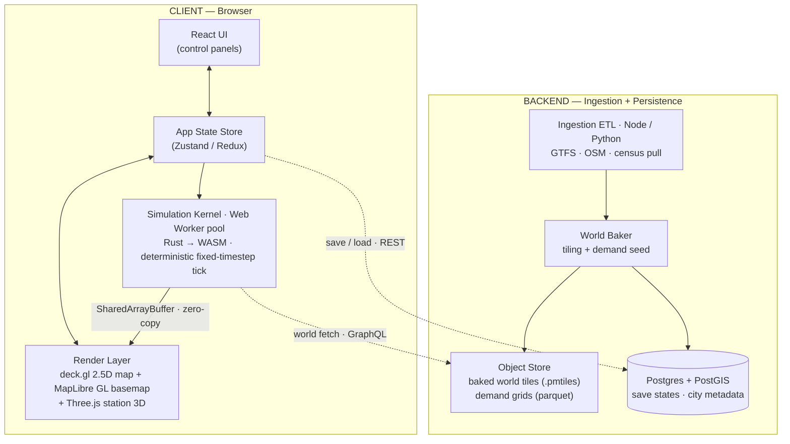
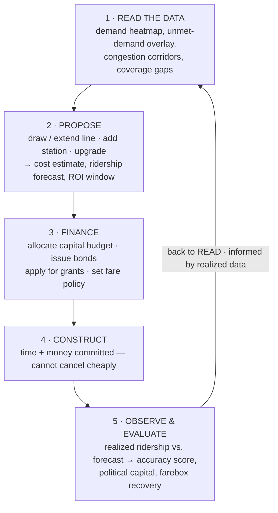
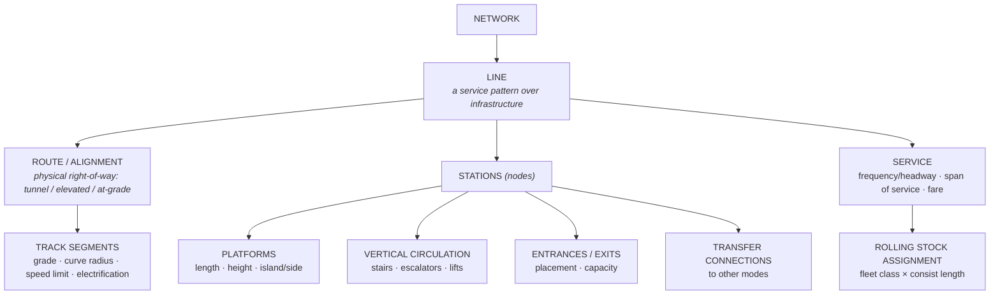
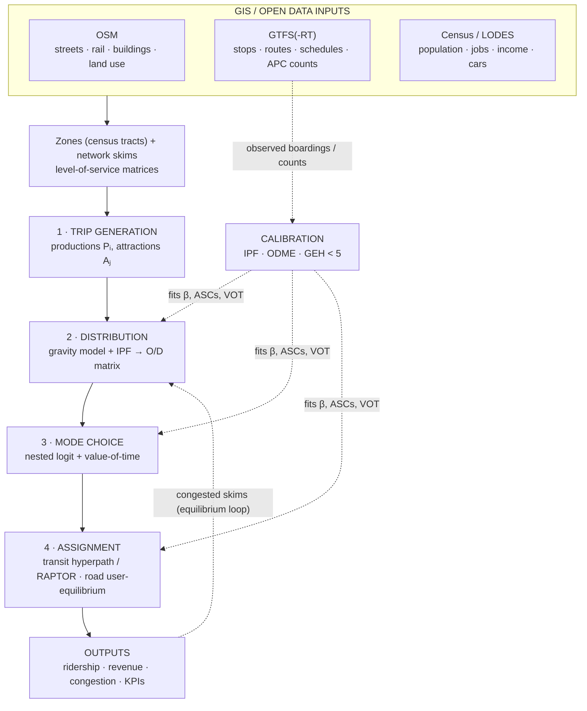
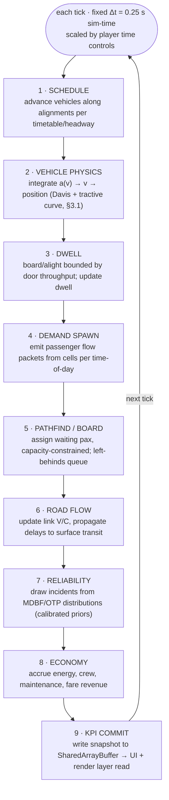
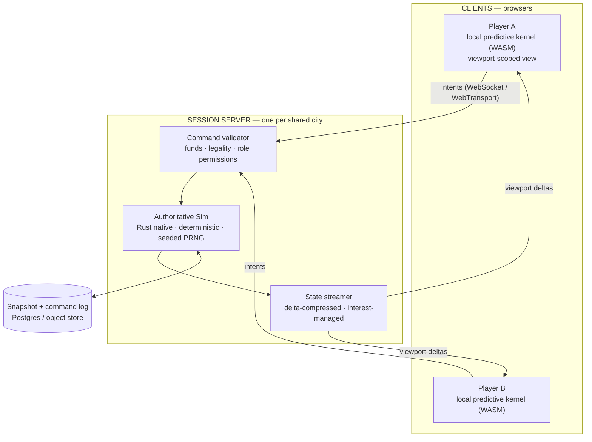

# Game Design Document — *Metro*

**A public transit simulation in a browser, made from real data**

*This document uses ASD-STE100 Simplified Technical English. The code blocks
and the diagrams are source code, and they keep their original text.*

| | |
|---|---|
| **Document type** | Game Design Document (GDD) — Master |
| **Version** | 0.9 (Draft) |
| **Owner** | Lead Systems Designer / Full-Stack Architect |
| **Status** | For technical review |
| **Genre** | Serious simulation / management |
| **Platform** | Web (current desktop browsers; the tablet is secondary) |
| **Design pillars** | Data fidelity · Consequential planning · Legible complexity |

---

## 0. Design philosophy and pillars

This project is a **serious simulation**. It is not an arcade tycoon game.
Three design pillars keep this difference. Each mechanic must obey them.

1. **Data fidelity.** The game does not author its world. It *derives* the
   world from open datasets: OSM, GTFS, and the census. These datasets give
   the streets, the population, the employment, and the first service. The
   player operates on a real city. The realism of the simulation is the core
   value of the game.
2. **Consequential planning.** The decisions are slow, expensive, and
   connected. There is no undo function for a tunnel. The game gives its
   reward for foresight, for sensitivity analysis, and for a correct reading of
   the data. It does not give a reward for fast reactions or for many clicks.
3. **Legible complexity.** The simulation is deep, but it is never hidden. The
   player must be able to trace each number back to its inputs. The interface
   has two tasks. It must let the player examine a system with many
   dimensions. But it must not give the player too much data at one time.

**The game does not have these properties:**

- Cartoon physics.
- Disaster events with no cause.
- Unlimited money.
- Fast manual control.
- Any mechanic with a result that the model cannot explain.

---

## 1. Technical stack and data architecture

### 1.1 The architecture

The application does most of its work in the browser. A small service does the
data ingestion and the storage. The heavy simulation operates in the browser,
in Web Workers with WASM. Thus the interaction stays fast and the server cost
stays low. The backend does the data ingestion, the world bake, and the storage
of the save states.



### 1.2 The client stack

| Layer | Choice | Reason |
|---|---|---|
| **UI framework** | **React 18** and TypeScript | The component model agrees with the control panels. Concurrent rendering keeps the interface fast while the simulation ticks. |
| **State** | **Zustand** for the interface, and immutable simulation snapshots | This has less code than Redux. The worker owns the simulation state, and the interface reads a snapshot only. |
| **Map rendering** | **deck.gl** above a **MapLibre GL** basemap | The GPU layers of deck.gl are made for large moving datasets. They give thousands of vehicles and demand cells at 60 fps. The layers are `ScatterplotLayer`, `PathLayer`, `TripsLayer`, `HeatmapLayer`, and `PolygonLayer`. |
| **Close 3D** | **Three.js** with `react-three-fiber`, in a deck.gl custom layer | The build mode at the station level needs true 3D for the platforms, the mezzanines, and the rolling stock. deck.gl draws the city, and Three.js draws the interior of a station. |
| **Basemap tiles** | **PMTiles** vector tiles from OSM, on our own server | There is no cost for each tile. The tiles are in the world bundle, and they operate offline. |
| **Simulation kernel** | **Rust**, compiled to WASM, in a pool of **Web Workers** | It is deterministic, fast, and it controls its memory. Rust has no garbage collector, which is important for a fixed-timestep simulation. |
| **Simulation to renderer** | **SharedArrayBuffer** and `Atomics` | The worker writes the vehicle positions and states. deck.gl reads them with no serialization. |
| **Charts** | **Recharts** or **VisX** for the panels, deck.gl for the map | This divides the 2D charts from the map analysis. |
| **Build** | Vite and wasm-pack | Fast hot reload. WASM is a first-class module. |

**Why the kernel uses WASM and not TypeScript.** The core loop is an agent
simulation. It operates on tens of thousands of demand cells and vehicles, at a
fixed simulation rate of 4 Hz. The renderer interpolates this to 60 Hz. A pause
from the JavaScript garbage collector makes the result non-deterministic, and
it makes the frames uneven. A Rust kernel gives three advantages:

- It is deterministic. Thus the results are reproducible, and a replay is
  possible.
- Its memory has a limit.
- It is 5 to 20 times faster.

### 1.3 The backend stack

| Item | Choice | Reason |
|---|---|---|
| **Ingestion ETL** | Python, with pandas and `partridge` for GTFS, and `osmium` or `pyrosm` for OSM | These are the best libraries for GTFS and OSM. |
| **API** | Node (Fastify) or Python (FastAPI). GraphQL for the world queries, REST for the saves | GraphQL lets the client request only the map area and the layers that it needs. |
| **Spatial database** | **PostgreSQL** and **PostGIS** | This is the primary store for the city metadata, the routing graphs, and the save states. It has spatial indexes for the tile queries. |
| **Baked artifacts** | Object storage that agrees with S3. **PMTiles** for the geometry and **Parquet** for the demand grids | These are static and easy to cache on a CDN. The world is a bundle, not a live query. |
| **Auth and saves** | JWT, with an owner for each save row | A save is a large binary blob of a simulation snapshot. Its key is the user and the city. |

### 1.4 The data ingestion pipeline

The pipeline changes three open data sources into one **baked world bundle**.
This is an offline batch process. The team calls it the "world bake". It
operates one time for each city. It does not operate while a player plays.

**The inputs**

| Source | Format | What the pipeline extracts |
|---|---|---|
| **OpenStreetMap** | `.osm.pbf` | The street network, with the road class, the lanes, the one-way flag, and the speed. Also the rail geometry, the land-use areas, and the building footprints with `building:levels` for the volume. |
| **GTFS / GTFS-RT** | CSV files in a zip | `stops`, `routes`, `trips`, `stop_times`, `shapes`, `frequencies`, `calendar`. This gives the **first** network that the player gets, and the **service pattern** that calibrates the demand. |
| **Census / land use** | Census tracts, such as LODES or ACS, or a proxy from OSM | The residents, the employment for each tract, and the points of interest, such as the schools, the hospitals, and the shops. This is the **seed of the origin and destination demand**. |

**The bake stages**

1. **Conflation.** Attach the GTFS stop coordinates to the OSM rail network and
   road network. Get the rail geometry from `shapes.txt`. Then make one
   connected graph with the walk edges, the transit edges, and the road edges.
2. **Demand seed.** Divide the city into **census tracts**. The demand data
   already uses this geometry. Each zone gets these values:
   - `pop` for the residents, `jobs` for the employment, and `poi_weight` for
     the attraction mass of each category.
   - A **land-use class**: residential, commercial, industrial, mixed,
     institutional, or green.
   - *(Phase 1 changed this from an H3 hex grid. See §4.1.1.)*
3. **The first origin and destination matrix.** Use the GTFS service levels and
   the census to make a synthetic morning-peak matrix. The method is a
   **doubly-constrained gravity model**. See §4.1. This matrix is the true
   demand that the player tries to serve.
4. **Calibration against reality.** Some cities publish GTFS-RT data or
   ridership statistics. Where this data exists, change the friction
   coefficients and the attraction coefficients of the gravity model. Continue
   until the simulated boardings of the *first* network agree with the real
   reported boardings. This is the accuracy model of §2.5. Then put the
   calibrated coefficients into the bundle.
5. **Tiles and export.** Write these three artifacts:
   - The PMTiles for the geometry.
   - The Parquet for the demand grid and the matrix.
   - A compact routing graph in CSR form, for the WASM kernel.

**The output is the baked world bundle.** It has a version, it never changes,
and a CDN serves it.

```
world/{city}/{version}/
  ├─ basemap.pmtiles          # streets, land use, water (render)
  ├─ network.graph.bin        # CSR multimodal graph (sim kernel)
  ├─ demand.h3.parquet        # per-cell pop/jobs/poi/landuse
  ├─ od_baseline.parquet      # calibrated O/D matrix
  ├─ gtfs_baseline.json       # inherited routes/stops/service
  └─ calibration.json         # gravity coeffs, accuracy factors
```

> **A result of this design:** the bake makes each version of a city identical
> for each player, byte for byte. Thus the leaderboards, the scenario
> challenges, and the shared saves have a meaning. A new GTFS feed makes a new
> version. It does not change a world that already exists.

---

## 2. The core gameplay loops

The game has **three loops**, one in another. Each loop has a different time
range. This structure is the difference between Metro and a management game
with many clicks. The player stays mostly in the strategic loop and the
tactical loop. The third loop is mostly for observation.

### 2.1 The strategic loop — capital planning (range: years)

The player is the planning division of the transit authority.



### 2.2 The tactical loop — service operations (range: weeks)

The network exists. Now the player controls *how it operates*.

- **The frequency and the headway** for each route, in each time band. The
  bands are the morning peak, the middle of the day, the evening peak, the
  evening, and the night.
- **The rolling stock.** Which fleet class operates on which line, and how many
  cars are in the train.
- **The fare structure.** Flat, by zone, or by distance. Also the transfer
  policy and the reduced fares.
- **The crew and the depot.** The shift plan, the depot capacity, and the trips
  with no passengers.

Each tactical decision has an **operating cost** for the energy, the crew
hours, and the maintenance. Compare this cost against the **quality of the
service**. The quality is the wait time, how full the vehicles are, and the
reliability. The quality then changes the demand.

### 2.3 The operational loop — the live simulation (range: one simulated day)

This loop operates continuously while the player observes. The player rarely
does an action here. The player looks at the results of the strategic decisions
and the tactical decisions, and reads the data.

- The vehicles move along the network on their schedules.
- The passengers start from the demand cells. They find a path across the
  graph, get on, transfer, and get off.
- These effects come out of the model: full vehicles, longer dwell times, buses
  that collect together, and congestion.
- The live KPIs change. Incidents occur at a rate that the model gives. The
  incidents are the breakdowns and the signal faults.

The player can **stop the time, make it slow (0.5×), or make it fast (to
approximately one day each minute)**. The player can also examine any vehicle,
station, or corridor.

### 2.4 The budget and the economy model

The economy keeps the **capital account separate from the operating account**.
This agrees with real transit finance. It is a deliberate decision for a
serious simulation.

**The capital account** holds large single payments:

- The purchase of the right of way.
- The construction of the tunnel, the elevated structure, or the surface track.
- The stations.
- The purchase of the rolling stock.
- The systems for the signalling and the electricity.
- The money comes from the surplus, from **bonds**, and from **grants**. A bond
  has a principal and an interest, and the interest is a cost in the operating
  account. To get a grant, the player must satisfy a target for the coverage,
  the ridership, or the equity.

**The operating account** holds the payments that repeat:

- **The revenue** is the farebox money, plus the money from the advertising,
  the shops, and the parking.
- **The costs** are the traction energy, the crew wages, the maintenance, the
  station operations, and the interest on the bonds. The maintenance cost
  increases with the use of the rolling stock. See §3.1.
- **The primary metric** is the **farebox recovery ratio**. This is the fare
  revenue divided by the operating cost. A real value is between 0.2 and 0.7,
  and the game *expects* such a value. The game does not ask for a profit. It
  asks the player to **satisfy the mandate** in a subsidy limit. The mandate is
  the coverage, the ridership, the equity, and the reliability.

**The failure state:** an operating loss that continues above the subsidy limit
decreases the credit rating. Then the bond rate increases, and the player must
decrease the service. Then the ridership decreases, and the decline continues.
This is the primary danger in the game. It comes out of the system. It is not a
scripted event.

### 2.5 The accuracy model

This mechanic makes Metro different, and it satisfies the mandate for a serious
simulation. **The game compares the forecast of the player against a model that
agrees with real performance.**

**The method:**

1. **The first calibration, at bake time.** §1.4 stage 4 gives this stage. The
   team tunes the simulation of the *real* network until its output agrees with
   the published performance of that city. The output must agree with the real
   boardings for each line, the real average speeds, and the real farebox
   recovery. The result is the **set of calibration coefficients**. The set
   contains the gravity friction `β`, the mode-choice constants, the dwell-time
   parameters, and the reliability distributions. These values are *known to
   reproduce reality* for this city.

2. **The forecast, at planning time.** The player proposes a change. The game
   then makes a fast **static assignment** with the same calibrated
   coefficients. This gives a **ridership forecast with confidence bands**. An
   example is "18,400 ± 2,100 daily boardings". The bands become wider when the
   proposal is further from the conditions that the calibration observed. A new
   line into an empty area is less certain than a new station in a dense
   corridor.

3. **The real result, at run time.** The full dynamic simulation then gives the
   *real* ridership. It is different from the forecast, because the static
   forecast cannot see the dynamic effects. These effects are the change of
   mode when the vehicles are full, the transfer penalties, the congestion
   feedback, and the new demand.

4. **The accuracy score.** The difference between the forecast and the real
   result becomes the **forecast accuracy** metric. A player with an accurate
   forecast has learned to read the model. Such a player gets **planning
   tools**, which are better analysis overlays and sensitivity controls. The
   player also gets **institutional credibility**, which gives cheaper bonds
   and easier grants. Thus knowledge about the simulation is a primary method
   of progression.

> **The design intention:** the accuracy model gives its reward when the player
> makes a correct mental model of the behaviour of a real transit system. A
> result is never arbitrary. When the ridership is too low, the model can
> always explain the cause, and the player can examine the full chain of
> causes.

**Historical performance is the base of the calibration.** Some cities publish
historical metro performance. This data contains the distributions of the
on-time performance, the load factors for each line, the dwell times, and the
incident rates. The pipeline takes this data directly and uses it as the
**prior** for the equivalent simulation subsystem. A player who makes a real
metro line longer gets the *real* reliability and the *real* load of that line
as the start condition. The changes of the player then move away from a real
start condition, not from an estimate by a designer.

---

## 3. Construction and customization

The construction obeys a strict **order of composition**. The player puts small
parts together to make large systems. Each part shows its engineering
parameters. It does not show an abstract level number.



### 3.1 Rolling stock

An **engineering data sheet** gives the rolling stock. There is no tier number.
The player selects a fleet class and can then change it. The simulation uses
these parameters directly in its physics and its economics.

**The parameters of each fleet class:**

| Parameter | Unit | Use in the simulation |
|---|---|---|
| **Seated capacity** | passengers/car | The comfort limit. Above it, the demand decreases. |
| **Crush capacity** | passengers/car | The hard limit for boarding. The load factor is the load divided by the crush capacity. |
| **Consist length** | cars (1–N) | Set for each service. The capacity is the value for each car multiplied by the number of cars. The platform length limits it. See §3.2. |
| **Tare mass** | t | An input to the tractive effort and the energy. |
| **Max power** | kW | It limits the acceleration at speed. |
| **Tractive effort curve** | kN against speed | It gives the **acceleration profile**. See below. |
| **Max service speed** | km/h | The track speed limits decrease it further. |
| **Service braking rate** | m/s² | It changes the approach to a station and the safe headway. |
| **Jerk limit** | m/s³ | A comfort limit on the change of the acceleration. |
| **Door count and door width** | — | These control the **dwell time**, which is the rate of boarding and getting off. |
| **Regenerative braking efficiency** | % | The recovered energy decreases the operating cost. |
| **Traction type** | EMU / DMU / locomotive | The energy source, the emissions, and the depot needs. |
| **Purchase cost** | capital | The game divides it across the service life. |
| **Mean distance between failures (MDBF)** | km | The reliability draw. A lower MDBF gives more incidents. |
| **Maintenance interval** | km or hours | It starts a scheduled maintenance. See the cycle below. |

**The power and acceleration curve.** The game calculates the acceleration with
physics at each simulation tick. It does not use a constant.

```
a(v) = ( F_tractive(v) − F_resistance(v) ) / (m_tare + m_pax)

where  F_tractive(v) = min( F_max ,  P_max / v )        # power-limited above base speed
       F_resistance(v) = A + B·v + C·v²                  # Davis equation (rolling + aero drag)
       a(v) is further clamped by the jerk limit and comfort ceiling
```

Thus a **full** train accelerates measurably more slowly, because `m_pax` is
larger. This makes the run time longer on a full peak service. It is a real
operating limit that the player must plan for. It is not a hidden multiplier.

**The maintenance cycles.** Each vehicle collects distance. The maintenance is
a **ladder of levels**. Each level takes the vehicle out of service for a time
and for a cost.

| Level | Usual trigger | Duration | Effect if the player defers it |
|---|---|---|---|
| **Daily check and cleaning** | each service day | one night | a small decrease of the reliability |
| **A-service (light)** | approximately 15–25k km | hours | the probability of a failure increases |
| **B/C-service (heavy)** | approximately 100–150k km | days | a large decrease of the MDBF |
| **Overhaul** | approximately 800k–1.2M km, or the middle of the life | weeks | a risk of a forced withdrawal |

If the player defers the maintenance to keep money, the **incident rate
increases**. A breakdown makes a delay, a delay makes the vehicles full, and
full vehicles decrease the demand. Thus the player has a real choice between
the short term and the long term. The **maintenance bay capacity** of the depot
limits how many vehicles get service at the same time. This is an
infrastructure limit (§3.2) that connects the fleet size to the depot
investment.

### 3.2 Infrastructure

**A station** is the object with the most detail. It has a real footprint and a
model of its internal circulation.

| Parameter | Options or range | Use in the simulation |
|---|---|---|
| **Footprint** | It occupies real land. It can need **land acquisition**. The cost increases with the land value from OSM and the land use. | A cost driver. Protected land can stop it. |
| **Construction method** | at grade / elevated / cut and cover / bored tunnel | The cost and the disruption are very different. A bored tunnel is the most expensive, but it disturbs the surface least. |
| **Platform length** | metres. It limits the number of cars. | A hard limit on the train capacity at that station. A short platform limits a full line. |
| **Platform configuration** | side / island / stacked / Spanish solution | It changes the transfer flow, the dwell efficiency, and the footprint. |
| **Platform height** | low / high | A level entry gives a shorter dwell and better accessibility. |
| **Vertical circulation** | The number of stairs, escalators, and lifts. Each has a rate in passengers/min. | It controls the **exit time**. If it is too small, the platform becomes full and safety limits apply. |
| **Entrance position** | The player positions each entrance on the street grid. | **It gives the catchment of the station.** The game calculates the walk access from the entrances, not from the centre of the station. A second entrance in the correct position can increase the ridership very much. |
| **Entrance capacity** | The fare gates and the width of the passage. | A limit at the peak. Above it, a queue starts. |
| **Fare zone** | gated / open / proof of payment | It changes the dwell, the fare evasion, and the staff cost. |

**The position of an entrance is a primary strategic decision.** The catchment
of a station is the union of the walk isochrones from *each entrance*. An
entrance on the far side of a river, a rail cut, or a large road can double the
catchment. One entrance in an incorrect position leaves demand behind a
barrier. The simulation calculates the pedestrian access from each entrance on
the OSM walk graph. Thus this decision uses data. It is not decoration.

**The platform length controls the rolling stock.** The formula is
`max_consist_at_station = floor(platform_length / car_length)`. The practical
capacity of a line is the **minimum** platform length of all its stations. Thus
the player must plan the full corridor. A better train has no value if one old
station cannot hold it. Selective door operation is available, but it is
expensive.

**The track and alignment segments** carry these values:

- The grade, in %.
- The minimum curve radius, which limits the speed.
- The speed limit.
- The electrification type.
- The signalling headway.

The signalling is a fixed block or a moving block. It gives the minimum safe
headway, and thus the maximum frequency of the line.

**A transfer hub** connects the network. It is a separate object that the
player builds.

- A hub connects two or more modes. Examples are metro, bus, regional rail,
  bike-share, and park-and-ride.
- An explicit **transfer graph** models it. Each connection has a **walk
  time**, a **vertical penalty**, and an **out-of-system penalty**. The last
  value is the perceived cost of a transfer, and real data calibrates it.
- **A transfer penalty decreases the demand.** The mode-choice model (§4) adds
  a perceived time penalty for each transfer. A good hub *decreases* that
  penalty and thus permits journeys that transit could not get. A good hub has
  short, level, protected walks, and a cross-platform interchange at the
  correct time.
- The player can configure a timed transfer at a hub. Then two or more lines
  arrive together and the connection wait is minimum. This is a difficult
  tactical option.

### 3.3 The mode catalogue

Each mode uses the same parts: the rolling stock (§3.1), the infrastructure
(§3.2), and a service pattern. But each mode has its own class of right of way,
capacity, cost, and flexibility. The game **does not let the player select a
mode by preference.** The demand data shows which mode is correct for a
corridor.

An example of too much construction is a heavy rail line along a street with
few persons. Then you get an unused asset and a very low farebox ratio. An
example of too little construction is local buses in a corridor with 20,000
passengers each hour. Then the assignment model fills the buses, the passengers
cannot get on, and they return to their cars.

| Mode | Right of way | Capacity (pax/hr/dir) | Rel. capital / km | Commercial speed | Stop spacing | Best use |
|---|---|---|---|---|---|---|
| **Heavy rail / Metro** | fully grade-separated | 25k–80k | ●●●●● | 30–40 km/h | 0.8–2 km | a dense city centre, the largest corridors |
| **Commuter / Regional rail** | dedicated or shared main line | 10k–40k | ●●●●○ (cheaper if it reuses a right of way) | 45–80 km/h | 2–8 km | suburb to centre, long distance |
| **Light rail (LRT)** | partly separate, some street running | 5k–20k | ●●●○○ | 20–30 km/h | 0.5–1.2 km | medium corridors, cities that grow |
| **Tram / Streetcar** | mixed traffic (street) | 2k–8k | ●●○○○ | 12–20 km/h | 300–500 m | a dense city, and to make a place |
| **Bus Rapid Transit (BRT)** | a dedicated busway with stations | 8k–25k | ●●○○○ | 20–30 km/h | 0.4–0.8 km | a capacity like rail, fast and cheap to build |
| **Local bus** | mixed traffic (road) | 1k–5k | ●○○○○ | 12–18 km/h | 200–400 m | coverage, low density, feeder routes |
| **Express / Limited bus** | road, often a highway or an HOV lane | 2k–6k | ●○○○○ | 25–45 km/h | wide / express | suburban express, park-and-ride |
| **Trolleybus** | mixed traffic with overhead wire | 1k–5k | ●●○○○ | 12–18 km/h | 200–400 m | street corridors with no emissions |
| **Ferry / Waterbus** | waterway (free right of way, expensive terminals) | 1k–5k | ●●○○○ | it changes with the tide and the wind | wide | a city that water divides; it makes a road detour shorter |
| **Monorail / APM** | an elevated guideway of one supplier | 5k–15k | ●●●●○ | 30–45 km/h | 0.6–1.5 km | airports, campuses, dense elevated corridors |
| **Aerial gondola / cable car** | a cable above the ground | 1k–4k | ●●●○○ | 10–20 km/h | fixed stations | steep ground, informal areas, river crossings |
| **Funicular** | rail on a steep grade | <2k | ●●●○○ | slow | 2 stations | a special link on a hill |
| **Demand-responsive (DRT) / microtransit** | on demand, with no fixed route | low | ●○○○○ | it changes | none (near the door) | very low density, the first and last part of a trip, paratransit |
| **Bike-share / micromobility** | the cycle network | feeder | ●○○○○ | 12–18 km/h | a grid of docks | it makes the access area larger |
| **Park-and-Ride (an access node)** | an interchange for cars | — | ●●○○○ | — | — | it changes a suburban car trip into a transit trip at the boundary |

**The ladder of exposure to congestion.** The most important property of a mode
is the graph edges that it operates on. See §4.2.

- **Fully grade-separated** modes are metro, monorail, and APM. Road congestion
  does not affect them. They keep their timetable under a load.
- **Partly separate** modes are LRT and BRT. They get a part of the delay at
  the junctions and on the shared segments.
- **Mixed traffic** modes are the tram, the trolleybus, and the local or
  limited bus. They get the full BPR delay of the roads that they share.

Thus the game models grade separation as an expensive purchase of reliability
that a player can measure. It is not a decoration. This is also why a dedicated
bus lane visibly changes the on-time performance of a surface route.

**The mode-fit function.** The player draws a corridor. The game then shows a
**cost-per-passenger curve for each mode**, from the forecast peak flow of that
corridor (§4.1) and its length. Each mode has a capacity limit and a cost
minimum. Thus the curves cross at natural density values. This gives the
correct tool for the corridor, but the game never forces the choice. The player
can select a different mode and accept the economics.

**The trunk and the feeder.** The feeder modes are the local bus, the
bike-share, the DRT, and the park-and-ride. They fill the trunk modes, which
are the metro, the BRT, and the regional rail. The mode-choice model (§4.1.4)
gives an *automatic* reward for a good trunk-and-feeder network. A good feeder
decreases the access and exit part of the full journey cost. Thus a cheap bus
route can increase the ridership of an expensive rail line that it never
touches. A trunk with no feeder cannot get its own catchment. This connection
is the centre of network design.

**The rolling stock for each mode.** The parameters of §3.1 change with the
mode. An EMU metro set has a third rail or an overhead line, it can use CBTC,
and it has many doors for a fast dwell. A diesel regional set has a long
consist, few doors, and a high top speed. An articulated BRT bus has road
physics and boarding at the kerb. An on-demand van has dynamic dispatch. The
models for the physics, the energy, the maintenance, and the reliability (§3.1)
apply to all of them. Only the values change.

### 3.4 Customization and progression

The customization is **engineering, not decoration**. The progression gives new
*capabilities and tools*. It does not give a larger number.

- **Fleet customization:** change the number of cars, the door configuration,
  the interior layout, and the traction package. The interior layout is a
  compromise. More seats give comfort, and more standing space gives capacity.
- **Signalling upgrades:** a change from a fixed block to CBTC or a moving
  block decreases the minimum headway. Thus the line carries more passengers
  with no new track. This is a large increase in capacity for a small capital
  cost.
- **Institutional progression:** an accurate forecast and a satisfied mandate
  give analysis overlays, cheaper finance, and a larger capital limit. See
  §2.5. Thus knowledge of the *model* gives more control of the *world*.

---

## 4. The simulation engine

The engine is a **deterministic, fixed-timestep, multi-agent flow simulation**.
It has a static forecast stage in front of it. It is a pipeline of subsystems.
The subsystems operate at each simulation tick, and the default rate is 4 Hz.

### 4.1 From the data to the ridership — the core algorithms

This is the centre of the game and its main claim to realism. **The decisions
of the player make the ridership, the revenue, and the congestion. The
algorithms are the same class that a real Metropolitan Planning Organization
uses.** The method is the standard **four-step travel demand model**: trip
generation, then distribution, then mode choice, then assignment. A
**calibration layer** connects each coefficient to observed data. No number
here is a designer estimate. Each number comes from the GIS, GTFS, or census
inputs, or from a calibration against real observed performance.



The pipeline operates in **two modes**, from the *same* calibrated
coefficients:

- A fast **static** pass for a forecast at planning time. It takes seconds. It
  gives the number with confidence bands that the player sees during the
  drawing of a line.
- A full **dynamic agent** pass at run time. This is the tick of §4.3.

The difference between the two is the forecast accuracy score (§2.5).

#### 4.1.1 From the GIS data to the zones

The pipeline divides the city into **census tracts**. These tracts are the
**traffic analysis zones (TAZ)**. The demand data already uses this geometry,
and a tract is the usual TAZ unit in real travel demand work.

> **Phase 1 changed this.** Before, the zones were H3 hexes at approximately
> resolution 9. Tracts are better for three reasons. First, the census and
> LODES inputs *already* use tracts, thus no step must move a centroid into a
> hex and lose data. Second, a tract boundary follows a real feature, such as a
> river, a freeway, or a rail line. Thus the demand layer looks like the real
> city and not like a honeycomb. Third, a tract is the standard TAZ unit, thus
> the calibration of §4.1.6 stays comparable with published models.
>
> This change has a real cost, and the team must record it. A hex has an equal
> area and it divides uniformly. A tract does not. There are two results.
> **(a)** A tract holds approximately the same population as another tract.
> Thus a choropleth above the tracts must show the **density**, not the raw
> count. If it shows the raw count, the map looks flat. The renderer already
> does this. **(b)** The level-of-detail plan of §6.3 said "use a coarser H3
> resolution when the zoom is low". That hierarchy is no longer free. The plan
> must instead group the tracts into block groups and then counties. Or it must
> add a hex grid again, for the rendering only.

A spatial join across the ingested layers gives the attributes of each zone:

- **The population** comes from the census. Then a **dasymetric** step refines
  it. This step moves the population onto the real OSM building footprints and
  weights it by `building:levels`. Thus the residents are where the buildings
  are. They are not uniform across the tract.
- **The employment** comes from LODES or the land use. It has sectors: office,
  retail, industrial, and institutional.
- **The attraction mass** comes from the OSM points of interest, with a weight
  for each category. A hospital or a university makes many more trips than a
  small shop.
- **The car ownership and the income** come from the census. These control the
  mode choice for each group of persons.
- **The network skims.** The pipeline calculates a **level-of-service matrix**
  for each origin and destination pair, for each mode. The matrix contains the
  in-vehicle time, the wait, the walk access, the fare, and the transfer count.
  The routing algorithms of §4.1.5 make these skims. The skims are the common
  input to the distribution step and the mode choice step.

#### 4.1.2 Step 1 — trip generation

The productions `Pᵢ` and the attractions `Aⱼ` are calculated for each **trip
purpose**. The purposes are Home-Based Work, Home-Based Other, and
Non-Home-Based. The method is a cross-classification or a regression on real
trip-rate tables. The NHTS rates are the priors.

```
Pᵢ = Σ_purpose  households(i) · trip_rate(purpose, income_band, car_ownership)
Aⱼ = Σ_purpose  a0 + a1·jobs(j) + a2·retail(j) + a3·school_seats(j) + a4·poi_mass(j)
```

Time-of-day factors then divide the daily totals into the peak band, the middle
band, and the off-peak band. **The urban density enters the model here.** The
demand heatmap that the player reads *is* this generation field. A dense zone
with mixed use makes and attracts many more trips.

#### 4.1.3 Step 2 — trip distribution

A **doubly-constrained gravity model** connects the productions to the
attractions. **Iterative proportional fitting (Furness, or IPF)** solves it.

```
T_ij = aᵢ · bⱼ · Pᵢ · Aⱼ · f(c_ij)        f(c_ij) = exp(−β · c_ij)   # deterrence function

iterate until convergence (balances the matrix to both margins):
   aᵢ = 1 / Σⱼ ( bⱼ · Aⱼ · f(c_ij) )      # row balancing → matches Pᵢ
   bⱼ = 1 / Σᵢ ( aᵢ · Pᵢ · f(c_ij) )      # column balancing → matches Aⱼ
```

The value `c_ij` is the general cost from the skims. The value `β` is the
travel friction, and the pipeline **calibrates it for each city** (§4.1.6).

The output is the **origin and destination flow matrix**. It gives the total
person trips between each pair of zones. It does not give the mode. A group of
zones with a high `Aⱼ` and a low `c_ij` gets the most trips. This is the
central spatial problem of the game.

#### 4.1.4 Step 3 — mode choice

A **nested multinomial logit** model changes each flow into a share for each
mode. The input is the **utility** of each mode, which is the negative general
cost.

```
U_m = ASC_m + β_t·(in-vehicle time) + β_w·wait + β_a·access/egress
            + β_x·(transfers · penalty) + β_c·(fare / VOT) + β_k·crowding + …

P(m) = exp(U_m / μ) / Σ_k exp(U_k / μ)      # nested: {car, transit} vs {walk, cycle}
```

- **The value of time (VOT)** changes money into minutes. It has a different
  value for each income group, from the census. Thus a fare change has a
  different effect on a passenger with a low income and on a passenger with a
  high income. This is the base of the equity mandate.
- The **alternative-specific constants (ASC)** and the `β` weights come from a
  **calibration against the observed mode shares**.
- **This step changes each build parameter into ridership.** A shorter headway
  decreases the `wait`. A better entrance position decreases the `access`. A
  better hub decreases the transfer penalty. A longer train with wider doors
  decreases the `crowding`. Each of these increases the `U_m` of transit and
  thus its share. The "▸ why?" panel (§5.4) shows which term changed.

#### 4.1.5 Step 4 — assignment

- **Transit assignment.** The static pass uses the **optimal strategies**
  model, which is also the **hyperpath** model of Spiess and Florian. A
  passenger gets on the first attractive line of a set, and the flow divides by
  the relative frequency. This is the correct method when several lines serve
  one stop. The exact timetable routing uses **RAPTOR** (Round-Based Public
  Transit Router) and the **Connection Scan Algorithm (CSA)** for the earliest
  arrival. The skims, the isochrones, and the dynamic pass use this routing.
  The assignment has a **capacity limit**. When the boardings approach the
  crush capacity, the effective frequency decreases and the passengers wait for
  the next service. This makes the full vehicles and the passengers who stay
  behind.
- **Road assignment.** The background car trips, and also the buses and the
  trams, load the road graph at **static user equilibrium**, which is Wardrop's
  principle. The **Frank–Wolfe** algorithm solves it, with the **BPR**
  volume-delay function (§4.2). The congested link times then go back into the
  skims. Thus a new rail line that relieves a road corridor is visible as a
  shorter car time. The new demand that follows is also visible.
- **Fast routing.** One forecast needs millions of shortest-path queries. Two
  methods make this possible in a browser:
  - For the road: **contraction hierarchies**, and **A\* with landmarks
    (ALT)**.
  - For the transit: the round pruning of RAPTOR.

#### 4.1.6 Calibration

The calibration makes the outputs *real*. Without it, they only look
reasonable.

1. **Seed and IPF.** Make a seed matrix, then use IPF to fit it to the census
   margins.
2. **Origin-destination matrix estimation (ODME).** Solve a two-level
   optimization. It moves the seed matrix until the **assigned** boardings and
   link volumes agree with the **observed** counts from GTFS-RT and from
   automatic passenger counters (APC). This fixes *where* the demand is.
3. **Coefficient fitting.** Tune the gravity `β`, the mode-choice `ASC` values,
   the `β` weights, and the VOT. Decrease the error against the observed mode
   shares and the boardings for each line. The methods are gradient descent,
   **SPSA**, and Nelder–Mead.
4. **The acceptance gate.** Accept the calibration only when the **GEH
   statistic** is `< 5` on most of the links, and the boarding totals are in
   the tolerance. Traffic engineers use the same standard.

The result is the coefficient set in `calibration.json` (§1.4). This set is
*known to reproduce the real boardings, speeds, and farebox of the city*. **Each
change by the player moves away from this calibrated start condition.** This is
why the game can claim its accuracy.

**The confidence bands.** Two methods give the ± value of a forecast. First, a
bootstrap across the calibration residuals. Second, a widening by the
**extrapolation distance**. This distance is the Mahalanobis distance between
the corridor of the proposal and the conditions that the calibration observed.
The corridor properties are its density, its land use, and its existing
service. A new station in a dense corridor with much data gives narrow bands. A
line into an empty area gives wide bands. This is the honest-uncertainty
mechanic of §2.5.

#### 4.1.7 From the ridership to the revenue

The boardings and the completed trips become money in the **fare engine**. The
engine reads the same fare policy that the player sets in the tactical loop.

```
fare(trip) =  flat      → constant per boarding
              zonal     → f(zones crossed)              # zones are a GIS overlay
              distance  → f(skim distance ridden)
              time-pass → amortized period-pass revenue

revenue = Σ_trips fare(trip) · (1 − evasion_rate) + ancillary(advertising, retail, parking)
```

- **The fare elasticity.** A fare change goes back into the mode choice through
  a short-term **fare elasticity**. A usual value is approximately −0.3. If the
  player increases the fare, some passengers change to the car or to an active
  mode. Thus the fare policy is a real compromise between the revenue, the
  ridership, and the equity. It is not free money.
- **The division of the revenue.** A journey can cross two operators or two
  authorities. This is important in competitive multiplayer (§7). The game then
  divides the fare revenue for each leg by distance. This agrees with real
  ticket settlement.
- **The cost.** The operating cost increases with each vehicle-km and each
  vehicle-hour. The **energy comes directly from the traction physics** of the
  rolling stock (§3.2). Add the crew cost and the maintenance. **The farebox
  recovery is the revenue divided by the operating cost.** It is the primary
  economic KPI.

#### 4.1.8 The feedback loop and the static/dynamic difference

Steps 2 to 4 **repeat until the network is at equilibrium**. The method is the
method of successive averages. The assignment gives congested skims. Those
skims change the distribution and the mode choice. Then the model assigns
again. This continues until the result is stable.

**New demand is exactly this loop.** A faster network with fewer passengers on
board decreases `c_ij`. A lower `c_ij` pulls new trips into the matrix in the
next cycle. These new trips can slowly remove the improvement that made them,
if the player does not add more capacity.

- **The static mode (the forecast):** the four-step equilibrium converges in
  approximately seconds. It gives the ridership number and the revenue number
  with the confidence bands, at planning time.
- **The dynamic mode (the real result):** the agent tick of §4.3 plays the
  demand across the simulated day. It uses the *real* vehicle capacity, the
  disutility of a full vehicle, the vehicles that collect together, and the
  reliability draws. The passenger flow packets start, wait, get on or stay
  behind, transfer, and can stop the trip or select a new route.

The difference between the static forecast and the dynamic result is the
accuracy score of §2.5.

### 4.2 Traffic congestion

The model has two connected networks: the **road** and the **transit**. They
interact. A bus shares a road. Road congestion moves the mode share to transit.
Full transit vehicles move it back.

**Road congestion — a macroscopic flow model.** The engine does not simulate
each car. That is too expensive for a full city in a browser. The roads use a
**mesoscopic model for each link**, with a volume-delay function.

```
travel_time(link) = t_free · [ 1 + α · (V / C)^γ ]      # BPR function
     V = assigned volume on link,  C = link capacity (from OSM lanes × road class)
     α, γ = calibrated congestion sensitivity
```

- The background car traffic comes from the non-transit trips in the matrix.
  The model assigns them to the road graph at equilibrium.
- **A bus or a tram on a shared road link gets the link delay.** Thus road
  congestion *directly decreases the reliability of a surface transit service*.
  Thus a dedicated bus lane, or the grade separation of a tram, becomes an
  investment decision that the player can measure.
- An intersection with signals uses a simple decrease of the capacity. The
  player can examine a primary corridor as a flow diagram.

**The congestion conditions that the engine models:**

| Condition | The behaviour of the model |
|---|---|
| **Usual peak congestion** | V/C increases at the usual times in the morning and the evening. The surface transit becomes slow. If a grade-separated rail line is available, the demand moves to it. |
| **An incident or a blockage** | The capacity `C` of a link decreases, because of a crash or a closure. The flow finds a new route on the road graph. The model propagates the queue to the links behind it. |
| **Full transit vehicles** | The boardings are more than the crush capacity. The passengers **stay behind** for the next service. The wait times increase. The dwell times increase, because the doors limit the flow. Thus the vehicles **collect together**. |
| **Congestion in a station** | The exit capacity (§3.2) is not enough. The platform becomes full. Safety limits the boarding. This goes back into the dwell time and the demand. |
| **Vehicles that collect together** | A late vehicle collects more passengers. Then its dwell is longer, and it becomes more late. The vehicle behind it comes closer. This comes out of the dwell and headway model. It is not a script. A holding strategy that the player enables can decrease it. |
| **New demand** | Better transit decreases `c_ij`. Thus `T_ij` increases in the next generation cycle. New passengers appear with time. They can remove the improvement, if the player does not add more capacity. |

### 4.3 The simulation tick



**Determinism:** each random draw uses a PRNG with a seed in the simulation
state. Thus one save and one sequence of inputs always give the same result.
This is necessary for the accuracy model, the replays, and the challenge
scenarios.

---

## 5. The user interface

The mandate of the interface is this: **show a control surface with many
dimensions, but keep the map clear.** The map is the primary display. The
design is a **contextual HUD in layers**. It is not a permanent wall of panels.

### 5.1 The layout philosophy

- **The map is first.** The deck.gl view is the canvas, and it fills
  approximately 100% of the screen. A panel is a translucent overlay. It
  appears when the player needs it, and it goes away cleanly.
- **Show the detail in steps.** There are three levels. *Glance* is the
  permanent strip. *Focus* is the contextual panel. *Deep* is the full analysis
  window. The player goes only as deep as the task needs.
- **One primary panel at a time.** A new Focus panel makes the other panels
  dark and small. Five floating windows are not possible.
- **Each pixel must have a use.** Use sparklines, small multiples, and small
  charts in the text. Do not use large dashboards.

```
┌───────────────────────────────────────────────────────────────────────┐
│  ▸ TOP STRIP (Glance): date/time · time-controls · budget · 4 core KPIs │
├───────────────────────────────────────────────────────────────────────┤
│ L │                                                                 │ R │
│ E │                                                                 │ A │
│ F │                    MAP CANVAS (deck.gl)                          │ I │
│ T │            vehicles · lines · demand overlay                     │ L │
│   │                                                                 │   │
│ M │                                                                 │ I │
│ O │              [ contextual Focus panel slides in here            │ N │
│ D │                only when an object/tool is active ]             │ S │
│ E │                                                                 │ P │
│ S │                                                                 │ ▾ │
├───────────────────────────────────────────────────────────────────────┤
│  ▸ BOTTOM: layer/overlay toggles · timeline scrubber · alerts ticker    │
└───────────────────────────────────────────────────────────────────────┘
```

### 5.2 The Glance level — the permanent strip

One strip at the top holds only the data that must always be visible.

- **The time controls** (pause, 0.5×, 1×, fast) and the clock and date of the
  simulation.
- **The financial state:** the capital balance, the trend of the operating
  balance as a sparkline, and the farebox recovery.
- **The four mandate KPIs:** the ridership, the coverage, the reliability
  (OTP), and how full the vehicles are. Each KPI is a small gauge. It becomes
  amber or red at a limit. The player can click it to open its analysis.

### 5.3 The left rail — the mode selector

A thin vertical rail of icons selects the **operating mode**. The mode changes
how the map reacts and which tools are available.

- **Inspect** (the default). Click a vehicle, a station, or a line to open its
  Focus panel.
- **Plan / Build.** The tools to draw a line, place a station, and select an
  alignment. This mode shows a planning canvas with the cost and the forecast.
- **Operate.** The service controls: the headways, the fleet assignment, and
  the fares.
- **Analyze.** Full-screen data overlays and reports.
- **Finance.** The budget, the bonds, the grants, and the fare policy.

### 5.4 The Focus panel

When the player selects an object, a panel opens at the right. The panel shows
only *that object*. Tabs hold the detail and keep the panel clean. The example
below shows a **line**.

```
┌─ LINE 3 · "Riverside" ──────────────────────[ ─ ][ × ]┐
│  ● Overview   ○ Service   ○ Fleet   ○ Infra   ○ Ledger │
├────────────────────────────────────────────────────────┤
│  Daily boardings   42,180  ▲3.2%   ┌ 24h load profile ┐ │
│  Load factor (pk)  0.88  ⚠ crush    │  ▁▂▅▇█▇▅▃▂▁▂▄▆▅▂ │ │
│  On-time perf.     91.4%            └──────────────────┘ │
│  Farebox recovery  0.41                                  │
│                                                          │
│  Forecast vs realized:  +6.4%  (over-performing)         │
│  ▸ why? [ crowding-driven mode shift from parallel bus ] │
├────────────────────────────────────────────────────────┤
│  Quick actions:  [ +Frequency ]  [ Lengthen consist ]    │
└────────────────────────────────────────────────────────┘
```

- The tabs let one panel show *many* parameters, but never all of them at the
  same time.
- **The sliders show a live forecast.** When the player moves a headway slider,
  the panel shows the calculated change of the KPI *before* the commit. The
  static forecaster operates in the background.
- **The player can trace each value.** Each KPI has a "▸ why?" control. It
  shows the inputs from the model that made the value. This satisfies the
  legible complexity pillar. No number is hidden.

### 5.5 The map overlays

The map is the best analysis instrument. The player can switch these deck.gl
overlays on and off.

- **The demand heatmap.** This is the generation field of §4.1. It shows where
  the trips are.
- **The unmet demand.** These are the trips that *want* transit but have no
  good option. This is the map of the opportunities.
- **The coverage isochrones.** These are the walk catchments from the station
  entrances.
- **The congestion.** The road V/C and the transit load, on a two-colour scale.
- **The flow ribbons.** The thickness of a line shows the passenger volume. The
  deck.gl `PathLayer` and `TripsLayer` draw them.
- **The accessibility and equity.** The number of jobs that a tract can reach in
  X minutes. This tracks the mandate.

The overlays know about each other, and a legend controls the colour space.
Never more than two overlays are active at the same time. Thus the map stays
legible.

### 5.6 The build mode and the 3D editor

In **Plan/Build** mode, the editing of a station opens a **Three.js editor**.
It is a deck.gl layer. It gives true 3D positions for the platforms, the
entrances, and the stairs and lifts. It shows the footprint, the cost, and a
preview of the pedestrian access. The player changes the zoom continuously from
the city (2.5D deck.gl) to one station mezzanine (3D). There is one camera and
two render systems.

### 5.7 Accessibility

- Full keyboard navigation. A command palette (`⌘K`) lets an expert player go
  to any object or tool.
- Overlay palettes that are safe for a person with a colour vision deficiency.
  The team validates them. A pattern is the backup signal.
- All time-critical data is also available as text or a number. It is never in
  a colour only.
- The player can change the size of a panel and its position. The layout stays
  for that user.

---

## 6. Items that cross the full design

### 6.1 The performance budget

| Target | Budget |
|---|---|
| Frame time | ≤ 16.6 ms (60 fps), with more than 5k visible vehicles |
| Simulation tick (in the worker) | ≤ 30 ms at 4 Hz, for a medium city |
| Static forecast (the planning feedback) | ≤ 300 ms, as the player sees it |
| First load of the world bundle | ≤ 8 s on broadband. The basemap comes first, and the simulation graph streams after it. |
| Client memory limit | ≤ approximately 1.5 GB (the WASM memory and the GPU buffers) |

To reach a large city, use three methods. First, group the demand by a **level
of detail**: the tracts, then the block groups, then the counties, when the
zoom decreases. The census geography nests, thus this hierarchy is free. But it
is not equal in area. See the note in §4.1.1. Second, group the flow packets
instead of one agent for each passenger. Third, draw only the objects in the
viewport.

### 6.2 Data licences and ethics

- **OSM** (ODbL) and the **GTFS** feeds need an attribution, and ODbL is a
  share-alike licence. The game shows the attribution in a credits panel. The
  derived world bundles obey ODbL.
- **There is no personal data.** The census and demographic inputs operate only
  at the level of a tract or a cell.
- **Equity is a design value.** The game models fair access and gives a reward
  for it. An example is the job access for a tract with a low income. The game
  does not treat the maximum ridership as the only goal. This is a deliberate
  decision for a serious civic simulation.

### 6.3 The save, the load, and the determinism

A save is a compact binary snapshot of the deterministic simulation state, plus
the log of the inputs. It has a version, and the version agrees with the
version of the world bundle. Thus a replay is reproducible, a scenario is
shareable, and a leaderboard is fair, because each player has the same baked
world.

---

## 7. Multiplayer and shared worlds

Multiplayer is a natural extension. It is not an addition at the end. The
single-player engine already has the two properties that a networked simulation
needs. First, a **deterministic kernel that commands control** (§6.3). Second,
**baked worlds that are identical byte for byte** (§1.4). The same world bundle
and the same seeded kernel give the same result for each player. Thus the
network must agree only on the **sequence of player commands**. It does not
have to send megabytes of world state. Three multiplayer modes use one netcode.

### 7.1 The modes of multiplayer

**A · Asynchronous — leaderboards and ghosts.**
Each player plays the same city and the same scenario seed alone. The game puts
the results in order by the mandate KPIs: the ridership, the farebox recovery,
the equity, and the forecast accuracy. A save *is* a compact **command log**
above a deterministic kernel. Thus the server can **simulate any submission
again to examine the score**. A false score is not possible, because the client
cannot make a result that the kernel would not make. The server can also draw
the network of another player as a translucent **ghost** overlay, for
comparison and learning. The number of players has no limit, and the cost to
host it is very low.

**B · Cooperative — a shared authority.**
Two to four players operate one transit authority in a live session. They
divide the organization by function:

- **The capital planner** draws the alignments, places the stations, and
  commits the construction.
- **The operations chief** controls the headways, the rolling stock, the
  depots, and the response to an incident.
- **The CFO** controls the budget, the bonds, the fare policy, and the grant
  applications.

Role permissions control who can spend money. A **shared audit log** records
each action. A large capital commitment can need a **second approval**. All the
players see one authoritative world state.

**C · Competitive — rival operators on one demand field.**
This is the most unusual mode, and only this data model permits it. Two or more
operators serve the **same calibrated demand**. The **mode-choice model and the
route-choice model divide the passengers between them** by the general cost.
This is the same mechanism that divides the trips between a car and transit
(§4.1.4). There are three sub-modes:

- **Open competition.** The operators run services above each other. The logit
  model gives each passenger to the operator with the lower general cost. That
  cost is the fare, the wait, the speed, and the comfort. Decrease the fare
  below the fare of your rival, or increase the frequency above theirs, and you
  get more share. But you also decrease your own farebox.
- **Franchise or tender.** An infrastructure manager, which is a role or the
  game, sells the corridors or the concessions. The operators make a bid. The
  bid can minimize the subsidy or maximize the premium. This agrees with the
  franchise systems of London and Europe.
- **Divided territory.** Each player owns a region. The regions meet at the
  **transfer hubs**. The players must agree about a **through service** and
  about the **division of the fare revenue** (§4.1.7). They can also charge
  each other for the **track access and the stations**. This is the economics of
  open-access rail.

### 7.2 The netcode architecture

The controlling fact is this: **planning is not a fast reaction game.** Thus
the tolerance for latency is high, but the correctness and the protection
against cheats are very important. Peer-to-peer lockstep with trust is not
possible. The correct design is a **simulation on the server, with a small
command protocol**.



- **The server owns the simulation.** The *same* Rust kernel operates on the
  server, but compiled to native code, not to WASM. It gives the true
  simulation for a session. A client never owns the truth.
- **The command protocol.** A client sends a small **intent**, for example
  "draw a line", "set a headway", or "buy stock". The server **examines** the
  intent for the money, the legality, and the role permission. Then it puts the
  intent on the deterministic timeline and applies it. The commands are small
  and infrequent, thus the upload bandwidth is very small.
- **The state stream has interest management.** The server sends **delta
  compressed** state. It sends only the vehicles and the KPIs that changed, and
  only in the **viewport** of each client. Thus the bandwidth for each client
  has a limit, and the size of the city does not change it.
- **The client predicts and then corrects.** Each client operates a local copy
  of the deterministic kernel. It applies its own commands immediately, thus
  the interface is fast. Then it corrects itself against the authoritative
  snapshots. The kernel is deterministic, thus a difference is rare and the
  correction is cheap. The actions of the other players arrive as commands, and
  each client replays them identically.
- **Determinism across platforms.** The native server kernel and the WASM
  client kernel must agree bit for bit. Strictly specified math, or fixed-point
  math, and one seeded PRNG give this agreement. The replays and the
  verification of a leaderboard already need the same discipline.

### 7.3 The time and the session control

The single-player pause and fast-forward cannot apply to a shared world. Thus
each mode controls the time in a different way.

- **Cooperative:** the world advances at an agreed ratio between the real clock
  and the simulation clock. A pause or a speed change needs the **agreement of
  the players**, which is a vote. Thus no player can stop the shared city
  alone. But each player can *examine* the world freely, because the interface
  is separate from the advance of the simulation.
- **Competitive:** continuous real time at a fixed speed, like a market. There
  is no pause. The construction times keep the speed strategic, not fast.
- **Asynchronous:** each player owns their own clock. Only the deterministic
  result goes to the server, and the server examines it.
- **Storage and reconnection:** the server holds the authoritative save, which
  is the snapshot and the command log in the object store or Postgres. A player
  can disconnect and connect again. A session can be a long "living city" or a
  scenario challenge with a fixed length.

### 7.4 The shared demand economy

The competition is fair and interesting because **the demand is a finite,
modelled resource. The game does not make new demand for each player.** The
service of each operator changes the general cost. Then the assignment step
divides the **same** population of passengers again. The results *come out of
the model*. No script controls them.

- Two operators give too much service in one corridor. Then a frequency war
  decreases *both* fareboxes.
- The new express service of a rival takes your long-distance passengers. But
  it can also **feed** your local services at the shared hub. This is
  competition and cooperation at the same time.
- A decrease in a fare starts the elasticity and a change of share. The "▸ why?"
  panel (§5.4) shows exactly which trips moved and why. Thus legible complexity
  continues in multiplayer.
- The division of the revenue and the access charges make the connection
  between two operators a negotiated relationship that the players can measure.
  It is not a menu control.

### 7.5 The scale, the cost, and the protection against cheats

- **One simulation process for each active session**, that is, for each shared
  city. The native Rust simulations use a pool across the nodes. A lobby
  service gives the players to a session and **stops an idle room**.
- **The bandwidth has a limit** because of the interest management. Thus a
  session in a very large city does not increase the traffic for each client.
- **The design prevents cheats.** The server owns the truth, and it can
  **simulate a result again** and compare the state hash. Thus any submitted or
  asynchronous result is reproducible. A client with modified code cannot make
  a result that the kernel would not make.
- **Cost control:** the asynchronous mode and the cooperative mode use the same
  baked bundles from the CDN. Only a live session uses a server process.

---

## 8. Progress and roadmap

This section is the live development timeline. It gives the full arc from the
first prototype to the v1.0 launch, in ten phases. Each phase has concrete
deliverables, an **exit gate**, and the **risks that it retires**. The exit
gate is the objective test that must pass before the next phase starts. The
risks refer to §9. The order of the phases puts the technical claims with the
most uncertainty first, when a failure is cheapest.

**The status symbols:** ✅ complete · 🔄 in progress · ⬜ not started

**The timeline assumption:** a core team of 3 to 5 persons across approximately
36 months. The team has a simulation engineer, a full-stack and graphics
engineer, a data engineer, a designer, and one more person. The durations are
estimates. They are not commitments.

### The milestones

| Milestone | Phases | Contents | Target |
|---|---|---|---|
| **M0 — Proofs** | 0–2 | The toy prototype, the data ingestion test, the WASM kernel, and the static model | Months 1–6 |
| **M1 — Vertical slice** | 3 | One baked city, rail only, the demand model, the static forecast, the Inspect and Build modes, and the core KPIs | Months 7–9 |
| **M2 — Operations** | 4 | The dynamic simulation, the full vehicles, the maintenance cycles, the operating economy, and the tactical loop | Months 10–13 |
| **M3 — Multimodal** | 5 | The buses on the road congestion model, the transfer hubs, and the mode choice across the modes | Months 14–17 |
| **M4 — Meta** | 6 | The accuracy score, the institutional progression, the grants and the bonds, the equity mandates, the scenarios, and the leaderboards | Months 18–21 |
| **M5 — Scale and polish** | 7 | The level of detail for a large city, more city bundles, the 3D station editor, and the full accessibility work | Months 22–26 |
| **M6 — Multiplayer** | 8 | The session simulation on the server, the asynchronous leaderboards and ghosts, the cooperative mode, and the competitive operators | Months 27–32 |
| **v1.0 — Launch** | 9 | The final work, the content, the readiness for live operations, and the launch | Months 33–36 |

### Phase 0 — the first prototype: "dots on lines" (weeks 1–6) ✅

This is the cheapest possible test of the core idea. Is it interesting to look
at a transit network that you designed? The test uses no real data and no real
technology.

- ✅ The game concept, the design pillars, and this GDD (v0.9).
- ✅ A toy in TypeScript only. It has an imaginary grid city of approximately 50
  zones and 2D canvas rendering.
  - Vite and strict TypeScript.
  - A 7×7 demand grid, with many jobs in the centre and many residents in a
    ring.
  - A deterministic fixed-timestep kernel at 4 Hz, with a seeded PRNG. Thus the
    determinism discipline of §4.3 and §6.3 started on the first day.
- ✅ Click to draw the lines and the stations. The vehicles are dots that move
  on schedules. The passengers are counts that start, wait, get on, and get
  off, with a simple shortest path.
  - A line that attaches to a station makes a transfer station.
  - Dijkstra across (station, line) states, with the headway wait and a
    transfer penalty.
  - Boarding with a crush capacity, and passengers that stay behind.
  - Directional demand in the morning and the evening, with an hourly profile.
- ✅ One KPI (the daily boardings) and a pause and speed control.
  - The strip has the clock, the controls for pause, 0.5×, 1×, 4×, and
    approximately one day each minute, and the daily boardings.
  - It also has the waiting, completed, and unserved counts, and a small Focus
    panel for a station and a line.
- ✅ A playtest with 5 to 10 persons. Do they lean forward and draw a second
  line with no instruction?

**The team deliberately did not build:** real data, Rust and WASM, deck.gl, the
economy, and everything else. This code is temporary, and the team will delete
it.

**The exit gate:** a playtester changes their network to increase the boardings
number, with no instruction. This shows that the observe-and-plan loop is
interesting.

**It retires:** the largest risk of all, which no person wrote down. The core
loop can be uninteresting.

### Phase 1 — the data ingestion test: one real city (weeks 7–14) 🔄

This phase proves the world bake pipeline (§1.4) from end to end, on **one
medium city with very good open data**.

**The team selected Houston.** There are three reasons:

- The METRO GTFS feed (mdb-2060).
- The LODES and gazetteer census coverage for Harris, Fort Bend, Montgomery,
  Brazoria, and Galveston.
- There is no heavy-rail metro. Thus the player starts with nothing.

- ✅ **The OSM extract, the GTFS parse, and the census join.**
  - GTFS ✅ — the parse gave the reference network: 115 routes, 21,878 trips,
    8,793 stops, and 229,813 shape points.
  - The census and the zones ✅ — the pipeline joined two values onto **1,560
    census tract areas**. The values are the LODES RAC value, multiplied by
    2.15 as a population proxy, and the WAC jobs value. The source is TIGERweb `Generalized_TAB2020`. It is the same 2020
    vintage as the LODES block geocodes, thus the GEOIDs join exactly. The
    total is 6.5M residents and 3.1M jobs, and no tract was lost. The ACS
    B01003 join waits for a Census API key, because access with no key is no
    longer available.
  - The zone geometry used H3 resolution 8 hexes until late in Phase 1. See the
    note in §4.1.1 for the reason for the change to tracts and for its cost.
  - The OSM street and rail graph ✅ — the pipeline queried Overpass as 48
    cached tiles across the stop area with padding. It got 184,650 ways and
    994,816 raw nodes. It collapsed them into a routing graph with **258,243
    nodes and 343,502 edges**: 39,258 km of road and 3,348 km of rail. Each
    edge has a one-way flag and a class. A single connected component holds
    99.5% of the edge length. The pipeline excludes `highway=service` on
    purpose. That class makes the way count three times larger and it routes
    nowhere.
- ✅ **The conflation pass.** It attaches the GTFS stops to the OSM network. It
  also makes a validation report. The report names each entity that does not
  match or that is malformed.
  - The projection knows the mode. A rail stop goes onto a rail, and a road
    stop goes onto a street. The result is **8,780 of 8,787 served stops
    matched (99.9%)**. The median snap distance is 5.9 m and the p90 is 9.4 m.
    99.4% are inside 25 m. All 80 rail stops matched.
  - `conflation.json` names the 7 stops that did not match. They are all
    park-and-rides and the kerb at Hobby Airport. Only the `service` roads
    reach these facilities, and the graph excludes those roads.
  - The team derived the geometry again from the artifacts. It agrees inside
    the coordinate quantisation of 1.1 m.
- 🔄 **The PMTiles basemap and the deck.gl rendering of the real city.** This
  shows the streets, the land use, the demand heatmap, and the ghost overlay of
  the reference network.
  - deck.gl above MapLibre GL ✅ — the layers are these:
    - A dark OSM basemap.
    - A **census tract demand choropleth** in a `PolygonLayer` (key D).
    - The METRO reference ghost overlay (key G).
    - A `PathLayer` for the lines.
    - A `ScatterplotLayer` for the stations and the vehicles.
    - An `IconLayer` for the interchanges.
  - The choropleth shows the **density**, which is the residents plus the jobs
    for each km². It uses quantile classes on a validated single-hue amber
    ramp. A tract holds approximately the same population as another tract by
    design. Thus a raw count looks flat. The density has a heavy tail: the peak
    is approximately 35 times the median. A log scale and a percentile stretch
    both collapsed the city into one or two steps of the ramp.
  - The basemap now uses hosted OpenFreeMap tiles. Our own PMTiles ⬜ — this is
    the last open item of this phase.
- 🔄 **The first baked world bundle** artifact, with a version, that a CDN can
  serve. Also the bake CLI that makes it.
  - One CLI with six stages: `npm run bake` writes
    `public/world/houston/v1/{demand,gtfs_baseline,stops,street_graph,conflation,meta,bake_report}.json`.
    It has a version, a cache, and the provenance and attribution of §6.2. JSON
    is a temporary substitute for the PMTiles and Parquet formats.
  - `--skip-network` skips the Overpass stages. Thus a demand-only bake takes
    seconds.
  - The graph is 26 MB, and it is deliberately **not on the boot path**. The
    client gets only the demand, the baseline, and the metadata. This keeps the
    exit gate of < 8 s possible. A stream for the graph is Phase 2 work,
    together with the binary format that it needs.
- ✅ **The validation and repair stage for a malformed feed.** It does schema
  checks and finds orphan trips and broken shapes.
  - The stage checks the full GTFS schema and its referential integrity. It
    checks the necessary files and columns, the duplicate keys, the coordinate
    and `location_type` ranges, and the `route_type` domain. It also finds
    these three defects: an id with no target, a `stop_sequence` that does not
    increase, and a time that is unreadable or backwards. The ids that it
    checks are `parent_station`, `route_id`, `service_id`, `shape_id`,
    `trip_id`, and `stop_id`. It streams all 1.4M `stop_times` rows
    in approximately 1 s.
  - There are three severities. A fatal error stops the bake. An error goes
    into the report. A warning gives information only.
  - Houston returns **0 integrity errors** and 4 quality warnings. The
    warnings are 6 stops with no service, 6 routes with no trip, 17 shapes
    with no use, and 4 services with no use.
  - A clean feed proves nothing. Thus `npm run check:gtfs` puts 17 defects into
    the feed, one at a time, and asserts that the stage finds each one. A
    control test asserts that the unchanged feed gives no message. This test
    operates first in `npm run bake`. Thus a feed that cannot make a
    trustworthy reference network fails loudly. It does not make an empty
    overlay in silence.
  - The earlier repairs still operate after this stage. They are the resequence
    of a shape, the removal of a bad coordinate, and the fallback across
    several URLs.
- ✅ **The road structures and the buildings render in the correct order.**
  - The roads were deck.gl geometry above the finished map frame. Thus they
    covered the labels and the building extrusions. They are now native
    MapLibre line layers in the style. The buildings hide them correctly.
  - The width of a carriageway is metre-exact. MapLibre uses 512 px tiles, so
    the usual 256 px constant gave half the correct width.
  - A ramp draws at 8 m from the `ramp` flag of the tiles. A tunnel does not
    draw. Each class has a minimum zoom: 34k features at z11 against 2k at
    z17.
  - The building extrusions are fully opaque, with a colour ramp of five
    steps. The layer anchors resolve for each style.
  - **Open:** a MapLibre line has its width in screen pixels, and there is no
    width in map units. Thus a road does not become smaller with its distance
    from the camera. At 65° of pitch a carriageway is four times too wide at
    the horizon. The correction is to draw the roads as ground polygons.
- ✅ **An invariant harness for the simulation kernel** (`npm run check:sim`).
  - It operates the real kernel against the real Houston bundle, in Node. It
    needs no browser and no test framework.
  - It has 8 checks in 5 groups: the determinism, the conservation of the
    trips, the fleet dispatch, the memory limits, and the performance.
  - The determinism check is the §4.3 contract. Two runs from one seed must
    agree after 20k ticks. The batch size must not change the result.
  - It found three defects. A new vehicle gave no service, because each
    vehicle started at the same position. To unassign a vehicle froze 1,062
    waiting passengers permanently. The plan cache had no limit and passed
    23,000 entries.
  - The kernel is TypeScript, not Rust. But the discipline that Phase 2 needs
    now exists, and a Rust kernel can use the same checks.

**The exit gate:** a new person opens a URL and sees their own real city with a
demand heatmap. The load must take less than 8 s on broadband. ✅ **Satisfied:
3.0 s.** The measurement used the production build (`vite preview`) in headless Chromium
with a cold cache, at 20 Mbit/s and 40 ms RTT. The timer ran from the
navigation to the removal of the loading overlay, which happens after the world
bundle resolves. The boot payload was **0.95 MB** across 11 requests. All the
parts use gzip. The parts are these:

- 490 KB of JS and 11 KB of CSS.
- 336 KB of `demand.json`.
- 26 KB of `gtfs_baseline.json`.
- Approximately 100 KB of basemap tiles.

There is approximately
2.6 times more time available. The 26 MB street graph is deliberately not on
the boot path. It is an input to the bake and the routing. It is not a client
payload.

**It retires:** §9-4, the variance in the quality of GTFS and OSM data. Real
messy data proved it, and the repair stage is in place.

### Phase 2 — the simulation kernel and the static model (months 4–6) ⬜

This is the deepest technical bet: the deterministic Rust and WASM kernel
(§1.2) and the four-step static model (§4.1), calibrated against the Phase 1
city.

- ⬜ The kernel skeleton in Rust: the fixed-timestep tick, the seeded PRNG, and
  the SharedArrayBuffer bridge to deck.gl. Also a determinism test in CI, which
  replays N ticks two times and compares the state hash. The test includes the
  comparison of WASM against native. *(The Phase 1 harness,
  `npm run check:sim`, already does the replay check on the TypeScript kernel.
  The Rust kernel can use the same checks.)*
- ⬜ The routing backends: contraction hierarchies for the road, and RAPTOR and
  CSA for the transit. Also the generation of the skims for the full zone set.
- ⬜ The four-step static pipeline: trip generation, then gravity and IPF
  distribution, then nested-logit mode choice, then hyperpath transit
  assignment and Frank–Wolfe road assignment.
- ⬜ Calibration v1: ODME and coefficient fitting against the observed boardings
  of the reference network. The target is a **GEH < 5 on most of the links**
  (§4.1.6).
- ⬜ A performance test at the scale of the Phase 1 city. It has two targets:
  - A static forecast for a line that the player draws, in ≤ 300 ms as the
    player sees it.
  - A kernel tick of ≤ 30 ms (§6.1).

**The exit gate:** the calibration gate passes on the pilot city. The simulated
reference network agrees with reality inside the tolerance. The performance
budget also holds in the browser.

**It retires:**

- §9-2 partly. This is the browser performance at a medium scale.
- §9-5. The determinism test exists from the first day.
- §9-1 and §9-6 partly. The calibration method is proven on one city with much
  data.

### Phase 3 — M1 vertical slice: the playable core (months 7–9) ⬜

This phase puts Phase 1 and Phase 2 together to make the first real *game*. The
player starts with nothing (§2). There is rail only, and one city.

- ⬜ The Plan/Build mode. Draw an alignment at grade, elevated, or in a tunnel.
  Each choice has a different cost. Place a station, position its entrances,
  and preview the walk catchment.
- ⬜ A live forecast with confidence bands for each proposal (§2.5). After the
  commit, the construction takes time and money.
- ⬜ The Inspect mode and the Glance strip: the four mandate KPIs, the budget,
  the clock, and the time controls.
- ⬜ Capital account v1, with the surplus and simple bonds. There is no
  operating detail yet.
- ⬜ The reference ghost overlay, with the real performance of each line. This
  is the first form of the benchmark loop (§2.5).
- ⬜ An internal build for the milestone. More than 20 external playtesters,
  with instrumented sessions.

**The exit gate:** the median playtester plays for ≥ 45 minutes without an
instruction, and can explain *why* their forecast was incorrect. This validates
the legible complexity pillar. The players also read the uncertainty bands
correctly.

**It retires:** §9-3 partly, the tension between the depth and the
introduction. This is the first evidence.

### Phase 4 — M2 operations: the living day (months 10–13) ⬜

This phase adds the dynamic mode (§4.3). The simulated day becomes a system
that the player can observe.

- ⬜ The full agent tick: the passenger flow packets start, wait, get on,
  transfer, or stay behind. The vehicle physics come from the tractive effort
  curves (§3.1). The dwell comes from the door throughput.
- ⬜ Verification that the effects agree with the model: the feedback from full
  vehicles, the longer dwell, and the vehicles that collect together. Also the
  holding strategies that decrease them.
- ⬜ Reliability draws from the MDBF and OTP priors. An incident then propagates
  a delay.
- ⬜ The maintenance ladder (§3.1), with the depot bay capacity and the results
  of a deferral.
- ⬜ The operating account: the energy from the traction physics, the crew, the
  maintenance, and fare revenue v1 with a flat fare. Also the farebox recovery
  KPI, the subsidy limit, and the decline after a downgrade (§2.4).
- ⬜ The interface for the tactical loop: the headway for each band, the consist
  assignment, and the Focus panel with live forecast sliders (§5.4). Also the
  first version of the "▸ why?" traceability.
- ⬜ The difference between the forecast and the real result is now available.
  Thus the forecast accuracy metric exists, but the game does not score it yet.

**The exit gate:** a scripted scenario is solvable by a playtester with the
telemetry only, and with no hint from a designer. The scenario is this: "your
line is above the crush load at 08:00. Correct it inside the budget."

### Phase 5 — M3 multimodal: the full toolbox (months 14–17) ⬜

- ⬜ The road congestion model: the BPR volume-delay function, and the
  background car traffic at user equilibrium. The congestion goes back into the
  skims.
- ⬜ The surface modes on the ladder of exposure to congestion (§3.3): the local
  bus, the express bus, the BRT, the tram, and the trolleybus. A dedicated lane
  and a grade separation visibly change the on-time performance.
- ⬜ The remaining modes of the catalogue: the ferry, the monorail and APM, the
  gondola, the funicular, the DRT, the bike-share, and the park-and-ride. Each
  gets its own rolling stock parameters.
- ⬜ The transfer hubs, with explicit transfer graphs, penalties, and timed
  transfers (§3.2). The trunk-and-feeder effect is measurable in the mode
  choice terms.
- ⬜ The interface for the mode-fit function: the cost-per-passenger curve for
  each corridor (§3.3).
- ⬜ The full fare engine: flat, zonal, distance, and passes, with the
  elasticity feedback (§4.1.7).

**The exit gate:** in a playtest, the players learn the lesson about too much
construction and too little construction (§3.3) from the economics alone. The
data teaches the mode choice, and no tutorial forces it.

### Phase 6 — M4 meta-game: mastery and mandate (months 18–21) ⬜

- ⬜ The forecast accuracy score and the institutional progression. Credibility
  gives cheaper bonds, grants, and new analysis tools (§2.5, §3.4).
- ⬜ The full finance: a bond market with a credit rating, and grant programs
  connected to the mandates for the coverage, the ridership, and the equity.
- ⬜ The equity overlays and the mandate tracking (§5.5, §6.2). A benchmark
  score against the reference network becomes the headline result screen.
- ⬜ The scenario framework: authored challenges with fixed seeds, win
  conditions, and par scores. The guided scenarios are also the tutorial ladder
  (this decreases risk §9-3).
- ⬜ Single-player leaderboards on the deterministic scenario results. This is
  before multiplayer, thus the verification is local only.
- ⬜ A **closed alpha** with hundreds of players and one city. The team collects
  telemetry about the retention, the difficulty, and the introduction.

**The exit gate:** the D7 retention and the tutorial completion rate of the
closed alpha satisfy the targets. A new player commits their first line inside
20 minutes, with no help.

**It retires:** §9-3, the introduction, at scale.

### Phase 7 — M5 scale and polish (months 22–26) ⬜

- ⬜ A stress program for a large city. It uses the level of detail for the
  demand, the grouping of the flow packets, and the culling of the viewport.
  The performance budget (§6.1) must hold on a city with more than 10k stops.
- ⬜ The city pipeline becomes industrial: 5 to 8 launch cities across the
  levels of data fidelity. The city selection screen shows the fidelity label
  (§9-1).
- ⬜ The Three.js station editor: 3D editing of the platforms, the entrances,
  and the stairs and lifts, with a live preview of the exit flow (§5.6).
- ⬜ The full accessibility work (§5.7): the keyboard navigation, the command
  palette, the validation for a colour vision deficiency, and the storage of
  the panel layout.
- ⬜ Hardening of the save and load. A policy for the bundle version and the
  migration. A panel for the credits and the data provenance (§6.2).
- ⬜ An **open beta** for the single-player game, on the set of launch cities.

**The exit gate:** the performance budget is green on the largest launch city,
on medium hardware. The open beta has a session rate with no crash of ≥ 99.5%.

**It retires:** §9-2 fully, the performance in a very large city.

### Phase 8 — M6 multiplayer (months 27–32) ⬜

The order follows the netcode risk. The cheapest comes first (§7).

- ⬜ **8a — asynchronous (months 27–28).** This phase adds the native kernel on
  the server. It also adds the simulation of a submission again, with a
  state-hash comparison, and then the leaderboards and the ghost overlays. This
  is the first hard test of the cross-platform determinism in production
  (§9-5).
- ⬜ **8b — cooperative (months 29–30).** This phase adds the session server,
  the command protocol, and the role permissions. It also adds the audit log,
  the time control by agreement, and the reconnection and storage.
- ⬜ **8c — competitive (months 31–32):** the shared demand assignment across
  the operators, the division of the revenue, the access charges, and the
  franchise and tender structure. Also balance work on the frequency war and
  the fare decrease (§7.4).
- ⬜ The lobby and matchmaking, the session pool, the hibernation, and the state
  stream with interest management. Also a load test at the target concurrency.

**The exit gate:** a cooperative city operates for one week, and a competitive
season is complete. There must be no determinism difference and no dispute
about a verified score.

**It retires:** §9-5 fully, in production.

### Phase 9 — v1.0 launch (months 33–36) ⬜

- ⬜ The content is complete: the final set of launch cities, each calibrated;
  the scenario catalogue; and the translation of the interface text.
- ⬜ Readiness for live operations. This adds four items:
  - The telemetry dashboards.
  - The pipeline that refreshes a feed and makes a new world version (§1.4).
  - The moderation and the reporting for multiplayer.
  - A status page.
- ⬜ A balance freeze, then release-candidate discipline. Only a fix that blocks
  a gate is possible.
- ⬜ Marketing that agrees with the shareable loop ("I designed my city better
  than the real one"). Press builds and creator builds have overlays that are
  good for a capture.
- ⬜ **The v1.0 release.** The backlog after the launch starts with more cities
  at intervals, seasonal scenario challenges, and a pipeline for mods and city
  requests.

**The exit gate, which defines v1.0:** each §6.1 budget is green on each launch
city. The calibration gate passes for each launch city, or the city has a
fidelity label. All three multiplayer modes are stable. There is no known
determinism failure. The introduction metrics are at the Phase 6 targets or
better.

### The timeline

```
Months   1   3   6   9   12  15  18  21  24  27  30  33  36
         ├───┼───┼───┼───┼───┼───┼───┼───┼───┼───┼───┼───┤
P0 Toy   ██
P1 Data    ████
P2 Kernel      ████
P3 Slice           ████            ← M1: first playable
P4 Ops                 █████       ← M2
P5 Modes                    █████  ← M3
P6 Meta                         █████          ← M4 · closed alpha
P7 Scale                             ██████    ← M5 · open beta
P8 MP                                     ███████  ← M6
P9 Launch                                        ████ ← v1.0
```

**The risk discipline:** the exit gate of each phase is objective, and this
document records it before the work starts. If a gate fails, the team makes a
scope decision *before* the next phase starts. The decision is to cut, to
decrease the scope, or to extend the time. A silent delay is not permitted. The
two longest risks are the browser performance (§9-2) and the cross-platform
determinism (§9-5). Both get their test in Phase 2, more than twenty months
before they can cause damage at scale.

---

## 9. Open questions and risks

1. **The availability of calibration data** changes very much between cities.
   Some cities publish much performance data, and others publish none. *The
   solution:* give a "fidelity" label to each city, and use the model priors
   from a comparable city where the data is absent.
2. **The browser performance in a very large city**, for example more than 10k
   stops, is the primary technical risk. The level of detail and the grouping
   of the flow must be proven early, in the M1 stress test.
3. **The tension between the depth and the introduction.** A serious simulation
   can have a learning curve that a new player cannot see. *The solution:* the
   "▸ why?" traceability is also a tutor in the context. The guided scenarios
   teach the subsystems one at a time.
4. **The variance in the quality of the GTFS and OSM data.** A malformed feed
   needs a strong validation and repair stage.
5. **The determinism across platforms.** The native server kernel and the WASM
   client kernel must agree bit for bit. This is necessary for multiplayer, the
   replays, and the verification of a leaderboard (§7.2). It needs fixed-point
   math, or floating-point math with strict rules, and a dedicated test in CI.
6. **The calibration data for the demand estimation.** ODME (§4.1.6) needs
   observed boarding counts from GTFS-RT or APC. A city with no such data must
   use the mode-share priors of a comparable city. The fidelity label must show
   this.

---

*This is the end of the document, v0.9 draft. The next review is the technical
sign-off on the WASM kernel performance budget (§6.1) and on the calibration
method (§2.5).*
